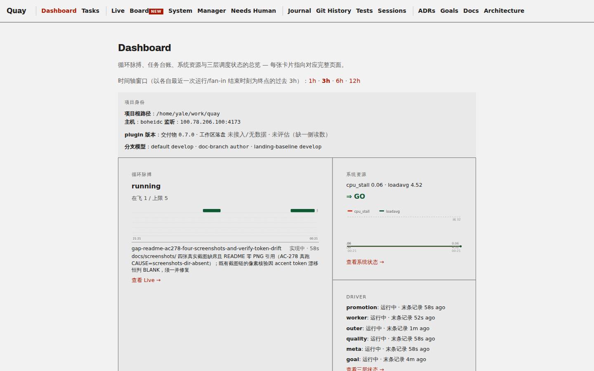
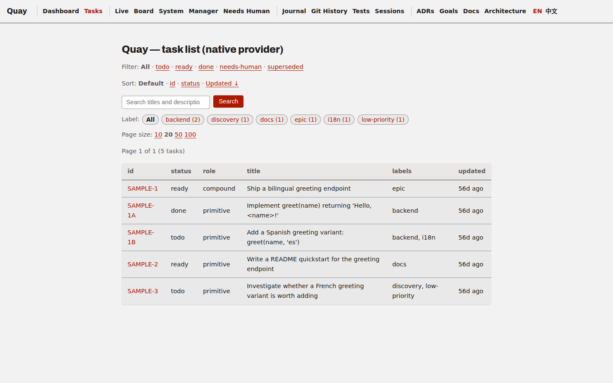
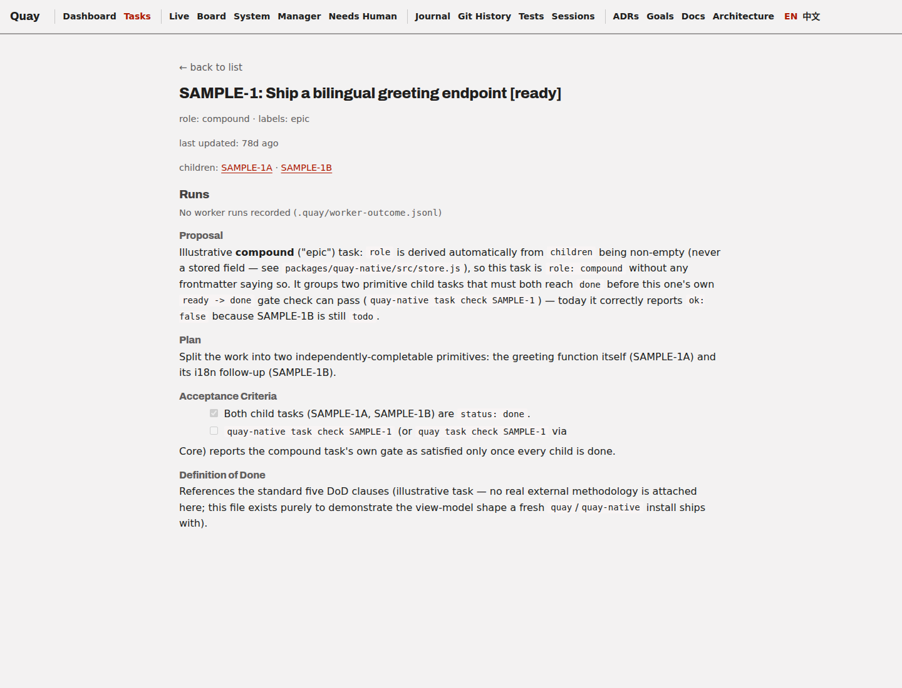
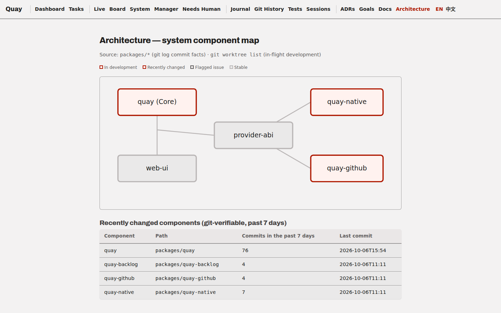
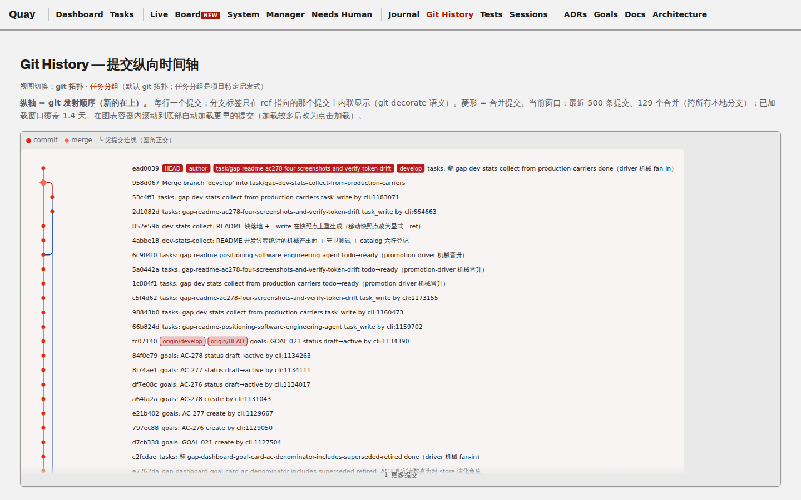
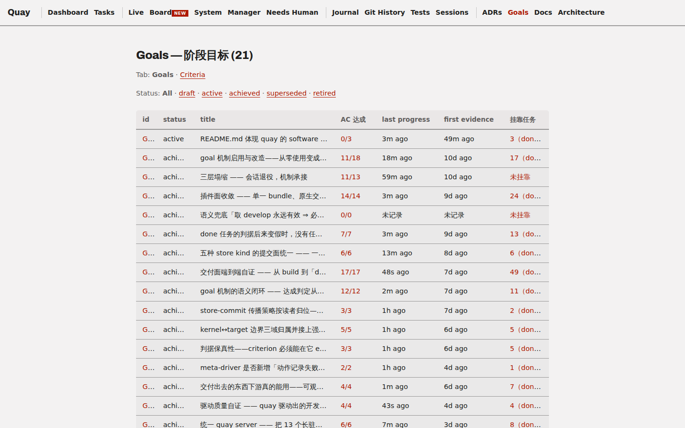
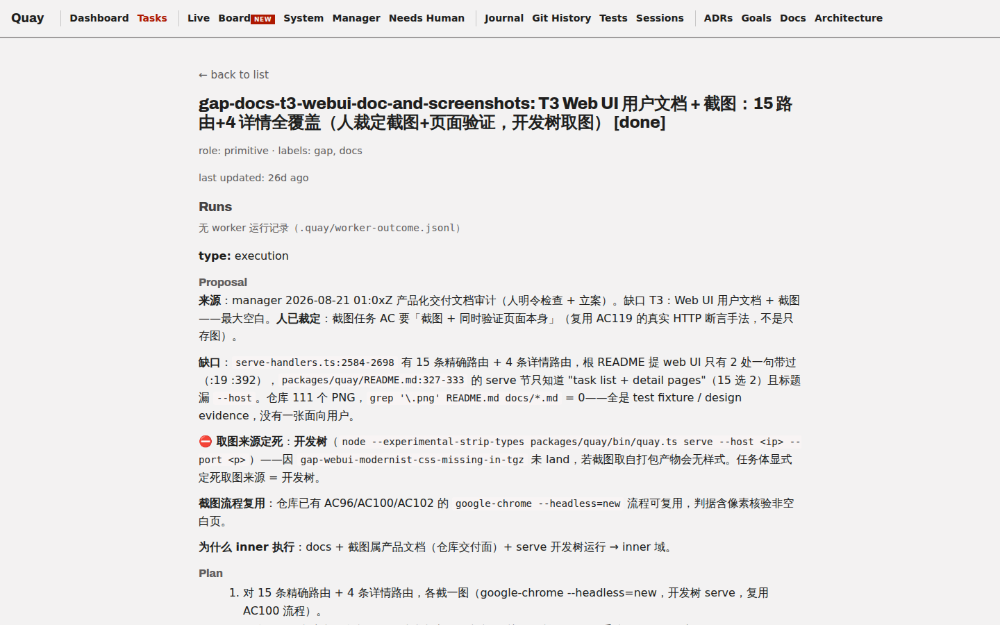

# quay

**`quay` is a software engineering agent whose distinguishing trait is high-throughput
development: it decomposes a goal into tasks, dispatches workers to implement them in
parallel, judges each result against runnable acceptance criteria, and lands the ones
that pass — continuously, unattended.**



*A real capture of `quay serve`, taken while this repository's own backlog was being driven
by the loop described below — not a mockup.*

`quay` is the same category of system as Claude Code or Codex, not a task-board framework,
a wire protocol, or an editor plug-in. What it runs *on* is **Claude Code**: Claude Code is
the infrastructure underneath `quay` in the same sense an operating system is infrastructure
underneath the programs running on it — `quay` consumes the LLM inference, tool invocation,
and subagent dispatch Claude Code provides, and builds the task model, lifecycle gates, and
driver loop on top. The direction is one-way: Claude Code is the ground `quay` stands on, not
an artifact `quay` produces.

Concretely, the surface `quay` exposes is a provider-agnostic task board: a small **Core**
CLI/MCP client plus a pluggable **Provider ABI** for where tasks actually live. A task can be
stored as local markdown+frontmatter files, mirrored to GitHub Issues, or (in principle)
backed by any other tracker that implements the same ABI — `quay` Core doesn't know or care
which.

This repository is also the live workspace for a BAIME (Bootstrapped AI Methodology
Engineering) research experiment in which `quay-native`'s own development backlog is driven,
progressively, by `quay-native` itself — see [**"Quay in practice"**](#quay-in-practice)
below for what that has actually produced, and [**docs/proposals/**](docs/proposals/) for the
deeper research story. Neither is required reading to install or use `quay`.

## What you can do with quay

- **Point it at a messy backlog and get a gated, prioritized task board.** Every task carries
  a `## Proposal` / `## Plan` / `## Acceptance Criteria` / `## Definition of Done` body; a task
  can't advance `todo → ready → done` without the gate for that transition actually passing.
- **Let it run unattended against your repo's own `tasks/*.md`.** `quay driver start --kind
  promotion` and `--kind worker` are resident processes: promotion advances `todo → ready`,
  worker isolates each `ready` task in its own git worktree, implements it, and lands it —
  while you do something else.
- **Swap the backend without touching your workflow.** The same task view-model (id, status,
  role, labels, Proposal/Plan/AC/DoD body) is implemented today by a local markdown+frontmatter
  store (`quay-native`) and by GitHub Issues (`quay-github`) — proving the Provider ABI
  transfers to a second, real backend rather than being a one-off local format.
- **Watch it work from a real web UI**, not just a CLI — the dashboard, task board, git-landing
  timeline, and architecture map below are the same four screenshots away.

## See it in action

A clean install starts from the small bundled sample workspace (5 illustrative tasks, no
experiment history) — not this repository's own ~2,200-task backlog:





The architecture view renders the Provider ABI directly from this repo's own `packages/*` and
git history — not a hand-drawn diagram:



## Quay in practice

**Built at high throughput.**

Every number below is a direct `git log` measurement against a real repository on the date
shown, not an estimate. Two case studies:

| | **quay itself** (dogfooding) | **CloudCLI** (`@yalehwang/cloudcli`, aka "Claude Code UI") |
|---|---|---|
| What it is | This repository's own backlog, driven by its own loop | A real, independent product — a web UI for Claude Code/Cursor CLI/Codex — [forked](https://github.com/yaleh/claudecodeui) and quay-driven since 2026-09-19 |
| Window measured | 2026-07-15 → 2026-10-07 (84 days) | 2026-09-19 → 2026-10-07 (18 days since the fork point, commit `fd424f3f`) |
| Commits | 27,008 total (~322/day average; peak day 2,833) | 5,548 since the fork (4,136 non-merge); ~308/day average |
| Scope landed | +182k / −36k lines across 600 files in `packages/` alone | 1,892 files changed, +411k / −7.5k lines |
| Task-branch landings | 5,110 isolated-worktree task branches merged via mechanical fan-in | 455 tasks tracked under `tasks/`; 1,551 `task_write` commits, 450 mechanical fan-in merges |
| Release cadence | 32 tags, v0.2.0 → v0.16.0, over 84 days | Its own tag series (`v1.37.3` → `v1.38.2`) continuing post-fork |

CloudCLI is a second, independently-verifiable data point, not an anecdote: it's a real fork of
[`siteboon/claudecodeui`](https://github.com/siteboon/claudecodeui), published to npm, with its
own git history anyone can inspect. Its own README additionally self-reports (not independently
re-measured here) a representative set of complex features landed in this window — a resident
long-lived-session architecture with a host/lease layer and systemd-scoped memory caps, a
pluggable voice-input recognizer registry, and a responsive composer/chat redesign.



quay's own live commit-count-over-time statistics (tasks done, scripts shipped, goals tracked)
are kept current automatically — see [**Development process
statistics**](#development-process-statistics) below, regenerated from this repo's own tracked
history rather than hand-maintained.

## The three packages

| Package | Role | Binary |
|---|---|---|
| [`packages/quay`](packages/quay) | **Core** — provider-agnostic CLI, web UI, and MCP client. Talks to whichever Provider is enabled in `.quay/config.yml` over the Provider ABI. | `quay` |
| [`packages/quay-native`](packages/quay-native) | **Native Provider** (the reference implementation) — a markdown+frontmatter task store on local disk, exposed over both a raw CLI and an MCP server. | `quay-native` |
| [`packages/quay-github`](packages/quay-github) | **GitHub Provider** — maps GitHub Issues onto the same canonical task view-model, proving the ABI transfers to a second, real backend. | `quay-github` |

A task has an `id`, `title`, `status` (`todo` / `ready` / `in-progress` /
`done`, etc. — Provider-defined), `role` (`primitive` or `compound`),
`labels`, `parent`/`children`, and a markdown `body` carrying Proposal /
Plan / AC (Acceptance Criteria) / DoD sections. Every Provider exposes the
same shape; `quay` Core is written against that shape only, never against
a specific backend.

## Sample workspace vs. this repo's own backlog

A fresh `quay`/`quay-native` install does **not** start from this
repository's own `tasks/` directory — that directory is this repo's own
**~267-file live dogfooding backlog** (the `quay-perpetual-stream` BAIME
research experiment's actual task board, tracked at the repo root and
driven by the outer loop under `experiments/`). It is experiment state, not
product data, and it is not part of any package's npm `files` whitelist
(`packages/quay/package.json`, `packages/quay-native/package.json`,
`packages/quay-github/package.json` — audited; none lists `tasks` or any
path reaching the repo-root `tasks/` directory, so it is never shipped in
an installed `quay`/`quay-native`/`quay-github` tarball).

Instead, `packages/quay-native` ships a minimal, documented **sample task
store** — [`packages/quay-native/examples/sample-workspace/`](packages/quay-native/examples/sample-workspace/)
— 5 illustrative tasks (one compound "epic" with two primitive children,
plus two standalone primitives) demonstrating the same view-model shape
(`role` derived from `children`, `labels`, and the
`## Proposal`/`## Plan`/`## Acceptance Criteria`/`## Definition of Done`
body sections) without any of this repo's own experiment history. Point
`quay-native` (or `quay` Core) at ONLY that directory to see it work in
isolation:

```sh
cd packages/quay-native/examples/sample-workspace
QUAY_NATIVE_TASKS_DIR="$(pwd)/tasks" node --experimental-strip-types ../../bin/quay-native.ts task list
```

See that directory's own `README.md` for the full walkthrough (including
the equivalent `quay` Core invocation via its bundled `.quay/config.yml`).
This is what a real `npm install quay-native` user gets a working example
from — not this repo's live backlog.

## Install

Requires Node.js >= 20 (this repo is developed against Node v25; see each
package's `package.json` `engines` field for the exact floor).

### Install channels: what changed on 2026-09-16

Human ruling 2026-09-16 retired the **npm and SEA release channels** (verbatim:
「取消 sea 和 npm release。这些是我们最近没有精力去保障的。」 and, on what the
release CI should gate on instead: 「按照 claude code plugin 发布和安装。CI 应当按此
设计。」). `.github/workflows/release.yml` no longer builds or uploads either
artifact — its header comment is the record of that ruling — and a GitHub
Release is now a **marking-only** object that carries no assets at all.

⇒ The Claude Code plugin (Option A) is the **sole supported install path** and
the **sole release gate**. There is no prebuilt tarball or executable to
download from [GitHub Releases](https://github.com/yaleh/quay/releases). The npm
tarball survives only as something you build yourself from a source checkout
(Option C), for developers and for environments the plugin channel cannot reach.

### Option A — as a Claude Code plugin (recommended)

**Prerequisite: `yaleh/quay` is a private repository.** Both commands below fetch the
plugin over HTTPS, so `git` must already be able to authenticate to GitHub without
prompting. `gh auth login` on its own is **not** enough — it stores an OAuth token for
the `gh` CLI, but it does **not** register a git credential helper, so the clone aborts
with `fatal: could not read Username for 'https://github.com': terminal prompts disabled`.
Register `gh` as git's HTTPS credential helper first:

```sh
gh auth login        # skip if you are already logged in
gh auth setup-git    # registers `gh auth git-credential` as a git credential helper
```

With that in place the two commands below work as written: Claude Code notices that SSH
is not configured on the machine and falls back to cloning over HTTPS on its own.

```
/plugin marketplace add yaleh/quay
/plugin install quay
```

This installs the quay MCP server + skills as a Claude Code plugin — no
separate `npm install` needed. The installed bytes come from the `dist-plugin`
branch (a CI-built, self-contained bundle), not `master`; see
[`plugin/README.md`](plugin/README.md#installation) for how that build/publish
pipeline works (DIR-108/M172).

**It also covers the CLI.** Claude Code puts every enabled plugin's `bin/`
directory on the Bash tool's PATH, and the plugin ships a shim there
(`plugin/bin/quay`) that execs the plugin's own bundled CLI
(`vendor/quay/dist/quay.js` — self-contained, Node ≥ 20, no dependencies to
install). So inside a session with the plugin enabled, `quay --help`,
`quay config validate` and `quay task list` work with **no npm install at all**.
Outside a Claude Code session, put the plugin's `bin/` directory on your own
PATH — or, if the plugin channel is unavailable to you, build the npm tarball
yourself (Option C below).

### Option B — from source (for development or the latest unreleased changes)

The same private-repository prerequisite applies here — if `git clone` stops at a
username prompt, do the `gh auth setup-git` step under Option A first.

```sh
git clone https://github.com/yaleh/quay.git
cd quay
npm install
cp .quay/config.yml.example .quay/config.yml   # see below — gitignored, not created by npm install
```

This is an npm workspaces monorepo (`package.json` `"workspaces": ["packages/*"]`)
— one `npm install` at the repo root wires up all three packages and their
shared dependency tree (`@modelcontextprotocol/sdk`, `yaml`, `zod`).

`.quay/config.yml` (the Provider map `quay` Core reads — see [Configuration](#configuration)
below) is per-workspace and gitignored, so a fresh clone doesn't have one; `.quay/config.yml.example`
is this repo's own real, working config, checked in so you don't have to construct one by hand
just to run `quay serve` or the test suite against your own checkout.

Each package also has its own binary you can invoke directly with `node`,
which is how every example below is actually run (no global install step
required):

```sh
node --experimental-strip-types packages/quay/bin/quay.ts <command>
node --experimental-strip-types packages/quay-native/bin/quay-native.ts <command>
node --experimental-strip-types packages/quay-github/bin/quay-github.ts <command>
```

For **development** — editing the web UI source under `packages/quay/src` and
seeing changes served without a manual restart — run `quay serve` under Node's
built-in watch mode (`--watch`, Node ≥ 18):

```sh
node --watch --experimental-strip-types packages/quay/bin/quay.ts serve --host 127.0.0.1
```

`node --watch` restarts the whole process whenever an imported module changes,
so a live-page edit takes effect immediately (the server's `GET /health`
reports `stale: false`, since each restart starts a fresh process). This is a
plain Node feature — deliberately there is **no** `--dev`/`--watch` flag on
`quay serve`; the built-in mechanism needs no product surface of its own.

### Option C — npm global install (build the tarball yourself)

> **There is no downloadable artifact.** The npm tarball is no longer published
> to GitHub Releases (see
> [Install channels: what changed on 2026-09-16](#install-channels-what-changed-on-2026-09-16)
> above) — a release page carries only a tag, never a `.tgz`. Every command
> below builds the package **locally from a source checkout**, and this option
> is for developers and for environments where the plugin channel (Option A) is
> unavailable.

From a source checkout (Option B), pack and install:

```sh
npm install                              # from the repo root, once (npm workspaces)
bash packages/quay/scripts/package.sh    # -> packages/quay/quay-<version>.tgz
npm install -g packages/quay/quay-<version>.tgz
quay --help
```

This installs the `quay` binary on your PATH, and **it also registers the quay
Claude Code plugin** (see
[Using the npm-installed quay with Claude Code](#using-the-npm-installed-quay-with-claude-code-quayinit)
below) — after a clean install, restart Claude Code and `/quay:init` is
available in any session.

This source-built path is distinct from Option A: Option A installs from the
`dist-plugin` branch directly, whereas this tarball registers the plugin bundle
that ships **inside the npm artifact**. Both land the same `/quay:init` entry
point and both provide a `quay` binary (Option A via the plugin's own
`bin/quay`, here via npm's global bin). If you installed via Option A, you do
not need this one (and vice-versa).

### Using the npm-installed quay with Claude Code (`/quay:init`)

The canonical way to onboard a project onto quay-driven development is the
`/quay:init` slash command in a Claude Code session (human ruling 2026-08-07).
The `npm install -g` path **registers the plugin automatically**:

- The package's `postinstall` hook (`packages/quay/scripts/register-plugin.mjs`)
  adds the **installed** plugin directory (`$(npm root -g)/quay/plugin`, a legal
  Claude Code *directory marketplace* containing `.claude-plugin/marketplace.json`
  and `plugin.json`) to `~/.claude/settings.json` as `extraKnownMarketplaces.quay`.
  It deliberately does **not** write `enabledPlugins["quay@quay"]` at user scope —
  the user level carries only the marketplace *source* (STANDING goal AC-161); a
  project opts in through its own `.claude/settings.json`.
- When the `claude` CLI is on `PATH`, the hook then runs
  `claude plugin marketplace add <installed-plugin-dir> --scope user`, which
  materializes the marketplace into `~/.claude/plugins/`. The enable step is
  **opt-in** (`QUAY_PLUGIN_SCOPE=user|project|local`) because `claude plugin install`
  defaults to `--scope user`.
- **After installing, restart Claude Code**, then run `/quay:init` in a session.

Verify the registration (the task's contract measure, must be `>= 1`):

```sh
grep -c "$(npm root -g)/quay/plugin" ~/.claude/settings.json
# 1
```

If the `claude` CLI was not on your `PATH` at install time (or a later Claude
Code version blocks install scripts), the hook still writes `~/.claude/settings.json`
and prints what to run once — you can either restart Claude Code and run
`/plugin install quay` in a session, or run:

```sh
claude plugin marketplace add "$(npm root -g)/quay/plugin"
claude plugin install quay@quay --scope user     # or --scope project / --scope local
```

**Pick the scope deliberately** — `claude plugin install` defaults to `user`, so
pass `--scope` explicitly, but the *value* is yours to choose. All three are legal
for the published channel `quay@quay`:

- **`user`** — one version for every project on this machine; upgrade in one place.
- **`project`** — a per-project on/off switch, with the version pinned in that
  project's `.claude/settings.json`.
- **`local`** — this working copy only, not committed.

The scope restriction is on the **dev** channel only: `quay@quay-dev`, the directory
source `<this repo>/plugin`, and quay paths in `env` must not reach the user level
(STANDING goal AC-161 / SPEC §4b), because that injects this repository's working tree
into every project on the machine. A user-scope `quay@quay` is a deliberate, legal
choice — not an AC-161 violation.

Registration deliberately does **not** enable the plugin at user scope (the hook
registers the marketplace source only): the user-level `~/.claude/settings.json`
carries only the marketplace source, and a project opts in through its own
`.claude/settings.json` (`{"enabledPlugins": {"quay@quay": true}}`). Pass
`QUAY_PLUGIN_SCOPE=user` to `npm install -g` if you deliberately want a user-scope
enable.

Opt-out (install the CLI without registering the plugin):

```sh
QUAY_SKIP_PLUGIN_REGISTER=1 npm install -g packages/quay/quay-<version>.tgz
```

This installs the CLI **without** registering the plugin. It is not the only way
to get a `quay` binary: Option A does too, with no npm install at all.
(Install scripts are what perform the registration; environments that set
`--ignore-scripts` or an npm `allow-scripts` denylist will skip it — see the
fallback above.)

## Updating quay

If you update quay (by reinstalling a locally-built tarball, or pulling from
source) while a Claude Code session that registered the `quay` MCP server is open,
**restart the Claude Code session** for the MCP server to pick up the changes.
The MCP server process is started once when Claude Code launches and does not
auto-restart when the underlying files change. After a restart, the updated tool
schemas and any new parameters will be available to the AI agent.

### Upgrading the quay plugin

Update the plugin **in place, at the scope its install record already holds**:

```sh
# (1) which scope actually holds the record? (never assume `project`)
claude plugin list --json | jq -r '.[] | select(.id=="quay@quay") | .scope' | sort -u
# (2) update in place, at that scope
claude plugin update quay@quay --scope <the scope just printed>
```

Then **re-run `/quay:init`** in each project: it re-points that project's
`.quay/plugin` symlink at the newly installed version's directory, drops the retired native
`path`/`mcp_entry` lines, and fills any version-level `loop:` default the new version added
(`board`, `gates`, …) without touching your comments, so `quay config validate` passes right after.
Restart the session to apply; running drivers keep the old version until
`quay driver restart` (`quay driver status` shows `loaded-version-behind`).

⛔ Do **not** `claude plugin uninstall` and then `claude plugin install --scope
project`: that replaces the record you already have, so a user-scope install is
silently swapped for a project-scope one. `update` upgrades in place, and if the
`--scope` you guessed is not the one holding the record it fails closed
(`✘ Failed to update plugin "quay@quay": Plugin "quay" is not installed at scope
user`) rather than moving it. Measured 2026-10-06 / Claude Code 2.1.290 in a
throwaway `CLAUDE_CONFIG_DIR`: on an unchanged version `update` prints `already at
the latest version` and leaves `installed_plugins.json` byte-identical; on a version
change it re-materializes the new version while keeping the entry's `scope` and
`installedAt`.

### Pre-release local drill — verify the plugin channel yourself (发布前本地演练)

`.github/workflows/release.yml`'s `verify-plugin-channel` job is the only release
gate, and its channel assertions live in **one** script —
`plugin/scripts/verify-plugin-channel-assertions.ts` — which you can run locally
before dispatching a release. It is a **checker**: run it from a **source checkout**
(the published artifact strips raw plugin `.ts`, so it is deliberately not part of
the installed tree). It asserts what the gate used to assume: the config
`/quay:init` wrote passes `quay config validate` **and** the MCP `config_validate`
tool; the version carriers (`VERSION`, `.claude-plugin/plugin.json`, and the byte
bundle's own `quay --version`) agree and carry no `-dev`; `.quay/plugin` resolves to
the verified install and the native provider freezes no `path`/`mcp_entry` into the
config; the driver and server version readings exist; and the serve host runs in its
own `quay-serve-*.scope`. Each assertion prints `PASS` / `FAIL` / `NOT-EVALUATED`;
exit `0` = all passed, `1` = a FAIL, `3` = could not judge (never conflated with a
pass).

Build the release-form tree, install it into an **isolated HOME**, init a scratch
project from it, and run the same assertions the gate runs:

```sh
# 1. build the plugin subtree (no push). Build FROM a `release/*` branch (or a vX.Y.Z tag) so the
#    build-mode stamp writes X.Y.Z, not X.Y.Z-dev; `git archive` the artifact, never a `cp`
bash plugin/scripts/publish-dist-branch.sh --branch plugin-channel-verify
ART=$(mktemp -d); git archive plugin-channel-verify | tar -x -C "$ART"

# 2. install through the marketplace into a throwaway HOME (never your real ~/.claude)
H=$(mktemp -d); mkdir -p "$H/.claude"
HOME="$H" CLAUDE_CONFIG_DIR="$H/.claude" claude plugin marketplace add "$ART"
HOME="$H" CLAUDE_CONFIG_DIR="$H/.claude" claude plugin install quay@quay --scope user -y
INST=$(HOME="$H" node -e 'const o=require(process.env.HOME+"/.claude/plugins/installed_plugins.json");process.stdout.write(o.plugins["quay@quay"].find(x=>x.scope==="user").installPath)')

# 3. init a scratch project from the INSTALLED copy, then run the assertions
P=$(mktemp -d); (cd "$P" && git init -q)
CLAUDE_PLUGIN_ROOT="$INST" "$INST/bin/quay" init \
  --root "$P" --project scratch --repo-root "$P" --test-command 'node --test' --plugin-root "$INST"
QUAY_VERIFY_HOME="$H" node --experimental-strip-types \
  plugin/scripts/verify-plugin-channel-assertions.ts --installed "$INST" --project "$P" --scope user
```

Run it with `--scope project` too (install `--scope project` from inside `$P`). For
the **upgrade drill** — the path that historically broke most often — start from a
project whose `.quay/plugin` points at a previous plugin tree and add
`--upgrade-from <previous-plugin-tree>`: the script asserts link→old, re-runs
`/quay:init`, then asserts link→new and a passing validate. Use `--json` for a
machine-readable report.

## Configuration

`quay` Core reads `.quay/config.yml` at the repo root to decide which
Provider(s) are available and how to launch each one's MCP server. This
repository's own config (used to drive its own backlog) looks like this:

```yaml
providers:
  native:
    enabled: true
    path: "./packages/quay-native"
    tasks_dir: "./tasks"
    mcp_entry: ["node", "./bin/quay-native.ts", "mcp"]
    env:
      QUAY_NATIVE_TASKS_DIR: "./tasks"

  github:
    enabled: false                       # native is the default; select explicitly via --provider github
    path: "./packages/quay-github"
    mcp_entry: ["node", "./bin/quay-github.ts", "mcp"]
    env:
      QUAY_GITHUB_REPO: "yaleh/quay"     # owner/repo this Provider reads issues from
```

A unified `.quay/config.yml` carries up to three top-level sections —
`providers`, `gates`, and `loop` (a `quay init` scaffold emits all three).

### `providers` — the Provider map

Each entry names an installed Provider package (`native`, `github`, or any
third-party Provider implementing the ABI). The `enabled: true` entry is
what `quay` Core actually talks to; the others are inert until enabled.
The `env` block is passed to that Provider's MCP server process verbatim.
The `mcp_entry` is the command Core spawns to reach the Provider's MCP
server.

### `gates` — named, runnable quality checks

The gate engine (QENG) runs named checks against a task via
`quay gate <task-id> [--gate <name>]`. Six gate types are supported
(`packages/quay/src/config-validate.ts`, `KNOWN_GATE_KEYS`), each a
key under `gates:` whose value is a list of gate definitions:

| Key | Shape | What it checks |
|---|---|---|
| `it0` | `{ name, script, argsKey }` | Runs `script`, passing the value of `task.extra[argsKey]` as the script argument. |
| `fixed` | `{ name, script }` | Runs a fixed script (no per-task args). |
| `testPass` | `{ name, command }` | Runs a shell command; PASS iff exit 0. |
| `coverageFloor` | `{ name, command, floor }` | Runs a coverage command, parses a percentage, PASS iff `>= floor`. |
| `redGreen` | `{ name, red, green }` | Runs `red` (must FAIL) then `green` (must PASS) — RED→GREEN (ADR-001). |
| `adr` | `[ "ADR-NNN", ... ]` | PASS iff each named ADR exists in the workspace `adr/` dir. |

All gate entries accept optional `cwd` (working-directory override) and
`timeoutMs` (deadline override). A built-in `acceptance` gate is always
available: it runs `task.extra.acceptance` as a shell command (fail-closed
if unset).

```yaml
gates:
  it0:
    - name: dod-check
      script: "./scripts/it0-dod-check.sh"
      argsKey: acceptance
  testPass:
    - name: vitest
      command: "npx vitest run"
  coverageFloor:
    - name: coverage-80
      command: "node --test --experimental-test-coverage test/*.mjs"
      floor: 80
  adr:
    - ADR-001
    - ADR-002
```

### `loop` — the autonomous iteration driver

The `loop:` section configures the loop driver (`quay run`), which scans
the board for ready tasks and drives them through gate checks. The full
field set (`packages/quay/src/loop-params.ts`):

| Field | Required | Default | Meaning |
|---|---|---|---|
| `board` | yes | — | Provider name to scan (e.g. `native`). |
| `gates` | yes | — | Gate name or list of gate names to run on each task (refs into `gates:`). |
| `stop` | no | `once` | When to stop: `once`, `until(.halt)`, `until(empty)`, or `until(<cond>)`. |
| `policy` | no | `ready-first` | Task-selection ranking policy. |
| `execution` | no | `dispatched` | Build style: `dispatched` (fresh background subagent) or `inline` (driver's own context). |
| `audit` | no | `adversarial` | Audit style: `adversarial` (fresh-context subagent audits the diff before land) or `none`. |
| `concurrency` | no | `1` | Max parallel builds; `> 1` requires touches-disjoint tasks (serial = 1). |
| `routines` | no | `[]` | Standing routine track; each entry is `{ name, trigger, dispatch? \| probe? }` (see below). |

Each `routines[]` entry is `{ name: <string>, trigger: <every(N) | interval:<N>m | on(<event>)>, dispatch?: <prompt> | probe?: <name> }` —
`dispatch` is the legacy prompt, `probe` (DIR-056) names a probe spec.

```yaml
loop:
  board: "native"
  gates: ["dod"]
  stop: "until(empty)"
  execution: "dispatched"
  audit: "adversarial"
  concurrency: 1
  # routines:
  #   - name: "health-check"
  #     trigger: "interval:30m"
  #     probe: "health"
```

## Creating a workspace

> **`quay init` vs `/quay:init` — do not confuse them.** CLI `quay init` scaffolds
> a brand-new **EMPTY** task store (`.quay/config.yml` + `tasks/`) — it does NOT
> install the loop mechanism, and it has no `--loop` flag (passing `--loop` is an
> error). To lay the full two-layer loop (workflows, agents, gate scripts, tick
> docs) into an existing project, the canonical path is the **`/quay:init` skill**
> inside a Claude Code session: `/quay:init --all --loop`.

`quay init` scaffolds a new quay workspace in any directory. It generates a
`.quay/config.yml` with all three sections (providers, gates, loop) and
inline documentation for every supported field, plus a `tasks/` directory.

```sh
# Scaffold a new workspace in the current directory:
quay init

# Preview the generated config without writing to disk:
quay init --dry-run

# Scaffold at a specific path:
quay init --root /path/to/project

# Machine-readable report (the same document the MCP `init` tool returns):
quay init --json

# Name the project (used for the .quay/profiles.yml role session prefixes):
quay init --project my-project
```

The generated config is valid immediately — `quay task list` works right after
`init` with no manual edits needed. Auto-detected project type (Node.js via
`package.json`, Go via `go.mod`) tailors the gate suggestions in the commented-
out examples.

Re-running `quay init` is safe and is the upgrade path: an existing config is
merged in place (comments, unknown keys and your own values preserved, retired
keys deleted, the candidate VALIDATED before anything is written), and a config
that is already current is not rewritten at all. An unreadable config is
rebuilt from the defaults with the broken bytes preserved beside it as
`.quay/config.yml.corrupt-<timestamp>`. There is no overwrite flag and no
reconcile selector — the target's state decides.

⛔ A fresh config carries no `serve:` section. Its values would be exactly the
fallback `quay serve` already uses (host `0.0.0.0`, port `0` = kernel-assigned),
so writing them would say nothing; uncomment the example in the generated file
only to pin your own binding.

`quay-native init` works identically when the native provider is the sole
installed package:

```sh
quay-native init --dry-run
```

### The branches `quay init` establishes — and why you should not work on `develop`

`quay init` (and the `/quay:init` skill) does more than write `.quay/config.yml`: it
establishes quay's **branch model** in your repository. Alongside your project's own
default branch — which quay never renames, moves or duplicates — you get:

- **`develop`** — quay's *landing baseline*. Task worktrees are forked from it, and every
  finished task is merged back into it. Treat it as automation-owned.
- **a doc-only work branch** — named `author` by default (`--doc-branch-name <name>`, or
  `loop.doc_branch` in `.quay/config.yml`, overrides it). `quay init` creates this branch
  and **switches your main checkout onto it**. That is deliberate, not a quirk: it is the
  one place you can edit that is *not* the line the automation lands on.

**Do not move your main checkout back to `develop` for day-to-day work.** `develop` is the
fork point for task worktrees and the fast-forward target of every task's fan-in — the merge
that lands a finished task. If you edit and commit on `develop` directly (the normal habit on
a single-branch project), your commits accumulate on the branch the fan-in expects to be
clean and strictly ahead of its worktrees, and the next task's `--ff-only` merge is refused
as a non-fast-forward. One blocked merge stalls the whole automated pipeline until the branch
is reconciled by hand, and the failure looks like a task problem rather than a branch-hygiene
problem. The doc branch exists exactly so this cannot happen: your edits accumulate where the
fan-in topology does not depend on them, and quay propagates them to `develop` for you.

You do not have to manage either branch by hand. But if a sync does go wrong, the mechanism —
which direction each branch propagates, and how a divergence is reconciled — is specified in
this repository's [`CLAUDE.md`](CLAUDE.md), section **"分支同步（author ↔ develop）"**. Read
that before diagnosing; this README deliberately carries only the "why" a user needs to avoid
causing a divergence in the first place.

## Enablement flow: in-session skills (the methodology, not just the task board)

quay is also a Claude Code **plugin** that lays the autonomous loop mechanism into
a project that has never used quay before. The enablement flow is
**session-embodiment**: the human starts **one** Claude Code session (however they
like — interactive `claude`, `claude --bg`, tmux, or an IDE), then runs skills
**inside** that session to activate each role. No script spawns a session, and there
is **no "start outer" step** — the outer session role was retired and its function
absorbed into the manager's direct subagent dispatch
(`orchestration/SPEC-tmux-retirement-2026-09-03.md` §1.4/Layer 3a).

```
# 1. install quay once — Claude Code plugin channel, the only supported one (see Option A above).
#    Requires a Claude Code session; the plugin then persists across sessions.

# 2. in the target project, start a Claude Code session yourself — HOW is your choice.

# 3. in that session, initialize quay (lays .quay / tasks / git branches + the loop mechanism;
#    YOUR test command is auto-DETECTED from scripts/test.sh / package.json /
#    go.mod / Cargo.toml — no need to know it in advance):
/quay:init --all --loop

# 4. in that session, start the drivers + web server (one idempotent call):
/quay:drivers

# 5. in that session, activate the manager (④ and ⑤ can be the same session):
/quay:manager
```

Steps ③④⑤ are all "invoke a skill in the current session" — never "launch a new
session". The session's lifecycle belongs to the human; quay only turns an
already-running session into a role. The retired `outer`/`inner` two-session tmux
model (`session-liveness.sh` / `quay-topology.sh` / `outer-session-check.sh` /
`topology-check.sh`) was **deleted, not migrated** — see
`orchestration/SPEC-tmux-retirement-2026-09-03.md`. The **model** the
`cold-start` skill described — "create an outer cron, then drive an inner
session" — is retired, and the `drivers` + `manager` skills above are its
successors. The skill **file itself is still shipped and still invocable**
(`plugin/skills/cold-start/SKILL.md`, listed in the session skill set as
`quay:cold-start`), but it opens with a `⛔ RETIRED` banner and the procedure it
describes must not be followed; it is retained for historical reference pending a
rewrite. Read it as history, not as the current cold-start procedure.

**Proving the loop is live is a one-shot reading; staying live is a cron.** Two
different things — only the first is a step you perform:

- **Liveness (once, right after ③④⑤):** ask the drivers, don't inspect the process
  table — `quay driver status --kind promotion --json` (and `--kind worker`) reports
  `{supervisor_pid, driver_pid, alive, …}`, and each driver appends its own heartbeat
  to `.quay/<kind>-driver-liveness.log`. The strongest reading is a *direct* artefact:
  a task worktree appearing under the worktree root with real commits in it. Something
  that merely *exists* is not evidence — a driver can be up while nothing is dispatched.
- **Continuous dispatch (afterwards, unattended):** the resident drivers keep
  dispatching on their own, and the manager layer re-evaluates on a **cron** tick —
  `/quay:manager` arms exactly one `CronCreate` job (sentinel `[manager-tick]`, via
  `plugin/scripts/manager-arm-loop.sh`), and the session's cron re-fires the tick.
  Dispatch is therefore periodic and unattended, **not** a human re-running a
  command; if the cron is gone the board stops moving while every process is still up.

> An older liveness reading — a `--task-start` **telemetry** record under
> `.workflow-events/*.jsonl` — belongs to the retired `inner` layer and to the
> retained `cold-start` skill that asserts it. The live driver pipeline writes
> the readings in the first bullet above, not that directory; prefer them.

What `--loop` lays into the target project (from the plugin bundle — nothing is
copied out of the quay development tree):

- `orchestration/orchestrator-loop-tick.md` + `docs/analysis/fast-mode-loop-tick.md`
  — the outer and inner tick documents, with `scripts/test.sh` / the quay repo
  root mechanically replaced by the target's own test command and repo root
  (no hand `sed`).
- `plugin/scripts/` — the checkers (`fast-mode-telemetry.ts`,
  `task-contract-check.ts`, `task-status-drift-check.ts`,
  `touches-orthogonality-check.ts`, `concurrent-batch-scheduler.ts`,
  `inner-blocked-signal.ts`, …), the resource gate, the heavy-op token, the
  capability catalog (`capability-catalog.sh` — see below), plus their transitive
  dependencies.
- `.quay/runtime/quay/quay.js` — the **built Core runtime artifact** (bundled by
  quay-init — a `.js` bundle distinct from the dev-tree source `bin/quay.ts` that
  the source-install commands above run), laid into the target's
  **`.quay/runtime/`** (quay's own namespace — never `vendor/`, which Go reserves,
  nor a `dist/` segment) so its `.quay/config.yml` `mcp_entry` points at a
  **project-local copy**, never at a `quay-native` PATH symlink into the quay dev
  tree (the loop must keep working even when that dev tree is gone).
  `.quay/runtime/` is gitignored by `quay-init` itself (gap-the-runtime-has-
  nowhere-safe-to-land AC10) — the runtime is a generated artifact, not source, so
  the 1.3MB bundle never trips a large-file pre-commit hook and never enters the
  target's tracked set.

### Capability catalog — what each installed check answers

Every shipped check declares the question it makes askable, in one machine-readable
line (the catalog, `plugin/scripts/capability-catalog.sh` — a script, never the
README, because prose drifts). `--loop` lays it into the target so an installed
project can see what it got:

```
$ bash plugin/scripts/capability-catalog.sh            # human-readable catalog
$ bash plugin/scripts/capability-catalog.sh --json     # machine-readable JSON
$ bash plugin/scripts/capability-catalog.sh --summary  # one summary line
```

The check count is **derived from the filesystem**, never hardcoded, and the catalog
is self-describing (it declares its own question). A script that enters the artifact
without a declared question is reported as unclassified and the catalog exits
non-zero — the entry-point gate that stops the undeclared-check number growing.
The `--json` output feeds the task's `## Contract` measures verbatim:

```
declared_questions = bash plugin/scripts/capability-catalog.sh --json | jq '[.[]|select(.question)]|length'
shipped_checks     = ls plugin/scripts/*.{sh,ts,mjs} 2>/dev/null | wc -l
unclassified       = bash plugin/scripts/capability-catalog.sh --json | jq '[.[]|select(.question==null)]|length'   # band 0
```

Upgrading an already-initialized project is the same command: `quay-init` is
idempotent, only fills the diff, and never overwrites local edits to laid-down
files (conflicts are listed for you to adjudicate).

## Usage

All commands below are real, live-run invocations against this
repository's own task backlog at the time this README was written — not
invented examples.

### `quay` Core CLI

`quay`'s own usage line (this is the literal message printed for an
unrecognized/missing subcommand):

```
usage: quay <adr|goal|meta|init|task list|view|create|edit|check|gate|gate-log|complete|adjudicate|promote|retreat|run|migrate|config validate|config check|action list|action run|serve|server start|server add|server stop|server restart|server status|mcp|manager start|manager arm|driver> ...
Run `quay --help` for full usage documentation.
```

List tasks through the active Provider (JSON form, truncated here for
brevity — the real output is the full task list):

```
$ node --experimental-strip-types packages/quay/bin/quay.ts task list --json
quay-native mcp: serving tasks from /home/yale/work/quay/tasks
[
  {
    "id": "QN-001",
    "title": "Wire task_write into quay-native CLI/MCP with full frontmatter patch semantics",
    "status": "done",
    "labels": ["v1", "data.write"],
    "parent": null,
    "children": [],
    "role": "primitive",
    "extra": {},
    "body": "..."
  },
  ...
]
```

View a single task, and run its gate check:

```
$ node --experimental-strip-types packages/quay/bin/quay.ts task view QN-001
quay-native mcp: serving tasks from /home/yale/work/quay/tasks
QN-001: Wire task_write into quay-native CLI/MCP with full frontmatter patch semantics [done]

## Proposal
...

$ node --experimental-strip-types packages/quay/bin/quay.ts task check QN-001
quay-native mcp: serving tasks from /home/yale/work/quay/tasks
QN-001: PASS — terminal
```

`quay task check <id>` is the ABI's **gate**: it asserts a task's
`author -> ready` and `execute -> done` transitions are honestly earned
(e.g. every AC checkbox that claims done is actually backed by evidence),
not merely that the checkboxes are ticked.

`quay serve` starts the web UI; `quay mcp` starts Core's own MCP server,
aggregating every `enabled: true` Provider from `.quay/config.yml` behind
a single MCP endpoint for an agent (e.g. Claude Code) to register once.

### Web UI

`quay serve` renders the board as server-rendered HTML (no client framework and no build
step). The dashboard, sample task board/detail, git-history, and architecture screenshots
near the top of this README are all real captures of a live dev-tree `quay serve` at
1440×900 — see ["See it in action"](#see-it-in-action) and ["Quay in practice"](#quay-in-practice)
above. Two more views, captured against this repository's own live backlog (primarily
Chinese-language task/goal titles, since that's this project's own working language —
shown here deliberately rather than cropped out):





Reproduce any of these against a running server with `docs/capture-webui-screenshots.sh`,
and pixel-verify a capture with `docs/verify-webui-screenshot.mjs`.

### Driver processes (`quay driver`)

The promotion and worker drivers are resident daemons kept alive by a single
supervisor. The unified entry point:

```
quay driver <start|stop|drain|resume|status|restart> --kind <promotion|worker|outer|quality|meta|goal> [--root <path>] [flags]
```

**A running deployment is three independent resident processes, not one.** The
enablement flow's step ④ (`/quay:drivers`) starts all three in one idempotent
in-session call; `/quay:drivers` is a convenience wrapper, and the start logic
lives in exactly one executable (`plugin/scripts/start-drivers.ts`) rather than
in the skill body. What it wraps — the hand-run equivalent, for any host with no
slash-skill channel (bare CLI, a non-Claude-Code host):

```sh
# 1. promotion driver — advances todo → ready by applying the author gate
quay driver start --kind promotion [--root <path>]

# 2. worker driver — dispatches ready tasks into per-task worktrees,
#    runs them to a gate verdict, and lands them (see "Task lifecycle" below)
quay driver start --kind worker [--root <path>]

# 3. the web UI — a SEPARATE process, with no supervisor of its own
quay serve --host <ip> --port <p>          # default host 0.0.0.0; omit --port ⇒ kernel-assigned port
```

All three have **independent lifecycles**: restarting one does not restart the
others, and `quay serve` is *not* supervised by the driver supervisor — the start
script backgrounds it itself (and reloads it when its `/health` reports
`stale:true`, i.e. the code in memory is older than the code on disk). The driver
kernel knows the kinds `promotion | worker | outer | quality | meta | goal`; a
project's enablement flow starts **promotion + worker**, the two that make a board
progress (`outer` the session role is retired — see the enablement-flow section).

`--port` is **optional**: with no `--port`, `quay serve` binds an ephemeral port
chosen by the kernel and publishes it in `<workspaceRoot>/.quay/server.json`
(`services[].port`), which is where a reader (`quay server status`, the start
script) learns the address. Pass `--port N` to pin an exact port — the value is
then honored exactly and a real collision fails loudly. A workspace root admits at
most **one** live host: `quay serve` takes an admission lock
(`<workspaceRoot>/.quay/server.lock`) before it connects the provider or binds
anything, so a second start on the same root exits 0 with
`quay serve: already running (pid=…)` instead of silently becoming a second host
on a different port.

| verb | semantics |
|---|---|
| `start` | Start the resident driver under the supervisor (respawn on exit/kill/crash) |
| `stop` | Hard stop: terminate the supervisor + driver. For worker, in-flight workers are **not** killed — they orphan and finish |
| `drain` | Halt new dispatch **without** killing in-flight workers (each kind writes its own `<kind>-control.json`, `halted=true`) — `worker` and `promotion` alike |
| `resume` | `drain`'s inverse: clear the halt (`halted=false`) so new dispatch resumes |
| `status` | Report `{kind, supervisor_pid, driver_pid, alive, …}` |
| `restart` | `stop` then `start` |

> **Cold-start in-flight handling is fixed** (was `gap-worker-driver-cold-start-inflight-blind`,
> now **done**): a cold start — an explicit `restart`, or the supervisor's auto-respawn after a
> crash — no longer **duplicate-dispatches** tasks whose workers survived it. The in-flight
> exclusion set is rebuilt by *probing* live workers and their worktrees, not from memory. The
> opposite residual (a cold-start worker that exits leaving its task pinned in-flight forever) is
> fixed too (`gap-worker-driver-cold-start-inflight-refresh`, **done**): cold in-flight entries are
> re-scanned on every pass and drop out as soon as the worker exits or its worktree disappears.
> A manual `restart` therefore needs no rescue step; `drain` remains the graceful-stop choice
> because it does not kill in-flight workers.

### `quay-native` (the reference Provider)

`quay-native`'s own CLI exposes raw local file operations directly
(mainly a convenience/debugging surface — the MCP server, started via
`quay-native mcp`, is the real ABI transport that `quay` Core and
Skill-driven agents actually use):

```
$ node --experimental-strip-types packages/quay-native/bin/quay-native.ts task list
QN-001	done	primitive	Wire task_write into quay-native CLI/MCP with full frontmatter patch semantics
QN-002	done	primitive	Build the GitHub Provider (second real backend, proves ABI)
QN-003	done	primitive	Port quay:author orchestration Skill (retire authoring seed dependency)
...
```

```
$ node --experimental-strip-types packages/quay-native/bin/quay-native.ts task get QN-001
QN-001: Wire task_write into quay-native CLI/MCP with full frontmatter patch semantics [done]

## Proposal
...
```

```
$ node --experimental-strip-types packages/quay-native/bin/quay-native.ts manifest
{
  "id": "native",
  "name": "quay-native",
  "description": "Reference Provider: markdown+frontmatter task store, two-layer Skill set, data-only MCP ABI.\n",
  "capabilities": {
    "data.read": true,
    "manifest": true,
    "data.write": true,
    "gate": true,
    "skill": true
  },
  "statuses": [
    { "id": "todo", "terminal": false },
    { "id": "ready", "terminal": false },
    ...
  ]
}
```

Other `quay-native task` subcommands: `edit` (status/body/labels/etc.
patch), `create`, and `check` (the same gate `quay task check` calls
through the ABI).

### `quay-github` (the second Provider — proves the ABI transfers)

`quay-github` maps GitHub Issues in a configured `owner/repo`
(`QUAY_GITHUB_REPO`, default `yaleh/quay`) onto the same task shape:

```
$ node --experimental-strip-types packages/quay-github/bin/quay-github.ts task list
gh-10	done	compound	[QN-037] Epic: live quay:execute Skill-driven compound-recursion end-to-end proof
gh-9	done	primitive	[QN-037-fixture] Child B: primitive leaf under live quay:execute epic-drive test
gh-8	done	primitive	[QN-037-fixture] Child A: primitive leaf under live quay:execute epic-drive test
...
```

It also exposes `task get <id>`, `task edit <id> --status <s>` (status-only
write path, v1), `manifest`, and `mcp` (its MCP server), mirroring
`quay-native`'s shape on whatever subset of the ABI this Provider
implements (v1 is read-primary; write is status-only).

### Task lifecycle: `todo` → `ready` → `done`

The examples above are read-only. Moving a task through its lifecycle is
done by the lifecycle commands, which run the ABI's gates and **mutate
state** (so they are shown here as the canonical flow shape against a
placeholder `T-000`, not a transcript of this repo's own board):

```sh
# 1. todo → ready: promote runs the author gate (DoD) and advances one step.
quay promote T-000
#    (todo → ready on gate pass; "ok: true, to: ready")

# 2. ready → done: complete runs the acceptance gate; on pass writes done.
quay complete T-000
#    (ok: true — acceptance passed, status now done)

# Equivalent one-step advance at any point (todo → ready via dod gate,
# ready → done via the acceptance gate):
quay promote T-000

# Independent, read-only audit pass — records an 'audit' GateEvent without
# delegating verdict authority to it (never writes status):
quay adjudicate T-000

# Roll back one legal step (done → ready, ready → todo, needs-human → todo).
# `reason` is required and is recorded in the GateEvent payload:
quay retreat T-000 --reason "acceptance found a regression"

# Run a named gate check directly (default gate is `acceptance`, fail-closed
# if the task has no acceptance command); every gate run appends a GateEvent:
quay gate T-000
quay gate T-000 --gate dod
quay gate-log T-000
```

A task's status transitions are: `todo → ready → done` forward (via
`promote`/`complete`), with `needs-human` as a terminal hold and `retreat`
as the legal backward path. `quay task check <id>` remains the ABI's gate
assertion — it reports whether every AC checkbox is honestly backed and the
task is in a gate-passing status, without mutating anything.

**What the status machine does not show: the landing path.** `done` is a task
state, not a landed change. Between `ready` and a landed change the worker driver:

- **isolates every dispatched task in its own `git worktree`** — one worktree per
  task (branched off `develop`), where it implements → self-audits → gates. The
  shared checkout is never edited in place, so concurrent tasks cannot collide;
- **may park a task in `needs-human`** — a terminal hold for work that needs a human
  decision — whose only legal way back is `retreat` to `todo`. A task can therefore
  move `ready → needs-human → todo → ready` more than once before it ever lands;
- **lands it through fan-in**, which happens *after* the status flip: merge
  `develop` into the task's worktree, run typecheck + the scoped gate + the full
  suite on the merged result, and only then fast-forward-merge the task branch into
  `develop`. A `done` task whose fan-in has not run is a claim, not a landed change
  — its code is still only on its own branch.

## Distribution: single-file executables (SEA) — **no longer published**

> **Retired, like the npm channel.** The 2026-09-16 ruling cancelled SEA
> publishing too, and `.github/workflows/release.yml` no longer builds these
> archives or attaches them to any release — the `sea-release` and
> `sea-verify-node-free` jobs are gone. **No release page carries a
> `quay-sea-*.tar.gz` or `.zip`.** See
> [Install channels: what changed on 2026-09-16](#install-channels-what-changed-on-2026-09-16).

The SEA build itself still works locally, and is documented here for anyone who
wants a Node-free binary. Built with
[Node.js SEA (Single Executable Application)](https://nodejs.org/api/single-executable-applications.html),
a single-file executable requires **no separately-installed Node.js runtime** on
the target machine at all.

Build one yourself from a source checkout (Option B):

```sh
bash packages/quay/scripts/build-sea.sh          # -> packages/quay/dist-sea/quay
bash packages/quay-native/scripts/build-sea.sh   # -> packages/quay-native/dist-sea/quay-native
```

An archive you assemble for distribution bundles:

- `quay` (`quay.exe` on Windows) — the Core CLI/web-UI/MCP binary
  (`packages/quay/scripts/build-sea.sh`).
- `quay-native` (`quay-native.exe` on Windows) — the native Provider binary
  (`packages/quay-native/scripts/build-sea.sh`). Both binaries are needed
  because Core spawns the active Provider's `mcp_entry` as a child process
  — `quay serve` is only genuinely Node-free end-to-end if `mcp_entry` also
  points at a compiled binary, not `node ...`.
- A `.quay/config.yml` wiring the two binaries together and a `tasks/`
  directory.

```sh
./quay --help
./quay serve
```

No `npm install`, no Node.js on `PATH`, nothing beyond the extracted directory
is required. `packages/quay/scripts/verify-sea-artifact.sh` exists for
verifying an artifact you built (the retired CI job used it to install and run
the binary in a Node-free `debian:stable-slim` container); nothing runs it on a
release any more.

See [`packages/quay/README.md`](packages/quay/README.md#distribution-single-file-executables-sea)
for the package-level version of this section.

## Running the test suite

The canonical entry point is the repo's single test runner (ADR-019 — a
structural test taxonomy with in-file skip and one canonical runner, never
an external exclusion list):

```sh
scripts/test.sh
```

Its header comment is the authoritative spec for globs, the three test
lanes (main/serial/lowconc), concurrency derivation, `--for-task` scoped
static-check layering, and `--test-concurrency=`. This is the same command
every iteration of this repository's own development process uses to
self-verify.

## Acceptance command environment

When the `acceptance` gate runs (`quay gate <id>`, default gate), it spawns
a shell command in a **clean environment** with the following contract:

- **No shell init files are sourced.** The runner spawns `sh -c`, which does **not**
  source `~/.bashrc`, `~/.profile`, or any other shell initialization file.
- **PATH is inherited from the invoking process**, not a fixed system default.
  The acceptance command sees the same `PATH` as the process that invoked
  `quay gate` (typically your shell or the agent's own process).
- **Default working directory** (`cwd`): the workspace root (where
  `.quay/config.yml` lives). Override with `--cwd <dir>` (highest precedence),
  the `QUAY_ACCEPTANCE_CWD` env var, or the per-gate `cwd` field in the
  workspace's gates configuration.
- **Default timeout**: 60000 ms (60 seconds). Override with `--timeout <ms>`
  (highest precedence), the `QUAY_ACCEPTANCE_TIMEOUT_MS` env var, or the
  per-gate `timeoutMs` field in the workspace's gates configuration. A
  timeout failure names both knobs in its reason message.
- **`acceptance_env`** (per-provider config key, DIR-103-C): a provider block
  in `.quay/config.yml` may declare an `acceptance_env` file path. Before
  every acceptance command dispatched through that provider, the runner
  **dot-sources** the configured file (`. <env-file> && <command>`), making
  its `export`-ed variables visible to the acceptance command. A relative
  path is resolved against the workspace root. If the configured file does
  **not** exist, the runner fails closed (exit 1) **before** executing the
  acceptance command — the acceptance command never runs. The
  `QUAY_ACCEPTANCE_ENV` env var overrides the config key when pre-set
  (mirrors the `QUAY_ACCEPTANCE_CWD` / `QUAY_ACCEPTANCE_TIMEOUT_MS`
  explicit-override-wins precedence — a pre-set env var is never clobbered).

Example `.quay/config.yml` with `acceptance_env`:

```yaml
providers:
  native:
    enabled: true
    # ...
    acceptance_env: "./.quay/acceptance.env"
```

Example `.quay/acceptance.env`:

```sh
export PATH="/custom/toolchain/bin:$PATH"
export CI=true
```

## Environment variables

`quay` and its Providers read a small set of environment variables for
paths, limits, and behavior overrides. The most commonly needed ones:

| Variable | Used by | Purpose |
|---|---|---|
| `QUAY_NATIVE_TASKS_DIR` | native | Override the tasks directory (default `<repo-root>/tasks`). |
| `QUAY_NATIVE_ADR_DIR` | native | Override the ADR directory (default `<repo-root>/adr`). |
| `QUAY_NATIVE_DOCS_DIR` | native | Override the managed-documents directory (default `<repo-root>/docs-managed`). |
| `QUAY_GITHUB_REPO` | github | `owner/repo` the GitHub Provider reads issues from (default `yaleh/quay`). |
| `QUAY_GITHUB_MAX_ISSUES` | github | Cap on the number of issues fetched per `task list` (default `500`). |
| `QUAY_GITHUB_MAX_BUFFER` | github | `maxBuffer` (bytes) for the `gh api` subprocess (default `64 MiB`); raise if a very large repo overflows it. |
| `GITHUB_TOKEN` / `GH_TOKEN` | github | Standard `gh` CLI token — pass through the provider's `env:` block. |
| `QUAY_ACCEPTANCE_CWD` | gate | Override the acceptance runner's working directory (see [Acceptance command environment](#acceptance-command-environment)). |
| `QUAY_ACCEPTANCE_TIMEOUT_MS` | gate | Override the acceptance runner's timeout in ms (default `60000`). |
| `QUAY_ACCEPTANCE_ENV` | gate | Override the acceptance env-file path (see above). |
| `QUAY_SKIP_PLUGIN_REGISTER` | npm postinstall | `1` opts out of Claude Code plugin registration entirely. |
| `QUAY_SKIP_PLUGIN_CLI` | npm postinstall | `1` skips the `claude plugin` CLI materialization sub-step (settings.json is still written). |
| `QUAY_PLUGIN_SCOPE` | npm postinstall | Scope for a deliberate plugin ENABLE: `user`, `project`, or `local`. Unset (default) registers the marketplace only — the user level carries no quay `enabledPlugins` entry (AC-161); enable per project instead. |
| `QUAY_ACTION_MOCK_LOG` | action | Path for deterministic mock/file-log action delivery instead of live delivery (DIR-009). |
| `QUAY_GLOBAL_DIR` | manager | Cross-project base directory for the manager layer (its session home is `$QUAY_GLOBAL_DIR/manager/`). |

## Development process statistics

Machine-generated from this repository's **tracked** development carriers (git history,
`tasks/*.md`, `goals/*.md`, `plugin/scripts/*.ts`) by
[`plugin/scripts/dev-stats-collect.ts`](plugin/scripts/dev-stats-collect.ts). The block is a
snapshot pinned to the commit it names, so the values are stable and any hand-edited number
stops matching — `--check` fails on that drift. Regenerate with `--write`; never edit by hand.

<!-- dev-stats:start -->
Snapshot commit: 4abbe18d912e61033ae7aba9757a03391f432c82
- snapshot_date: 2026-09-17
- history_days: 63
- tasks_total: 2223
- tasks_done: 2149
- tasks_superseded: 71
- commits_total: 22711
- scripts_total: 254
- goals_total: 157
<!-- dev-stats:end -->

## Deeper design and methodology material

The [`docs/proposals/`](docs/proposals/) directory is **internal experiment
documentation**, not primary user documentation — it captures the design
of the Provider ABI, the native Provider, and (distinctly) the BAIME
bootstrap-experiment protocol under which this repository's own backlog
has been developed. Start with:

- [`docs/proposals/glossary.md`](docs/proposals/glossary.md) — frozen
  vocabulary (Provider, Skill, status, lane, task, run, action button,
  capability) used consistently across the rest of `docs/`.
- [`docs/proposals/quay-proposal.md`](docs/proposals/quay-proposal.md) — the
  original Core/Provider-ABI design proposal.
- [`docs/proposals/quay-native-design.md`](docs/proposals/quay-native-design.md)
  — the native Provider's design (task store, ABI, gate, Skills).
- [`docs/proposals/quay-perpetual-stream-experiment-v5.md`](docs/proposals/quay-perpetual-stream-experiment-v5.md)
  — the current BAIME self-hosting bootstrap experiment protocol that has
  driven this repository's own iterative development
  ([`experiments/quay-perpetual-stream/`](experiments/quay-perpetual-stream/)
  holds its running log, dashboard, and per-iteration telemetry).
- [`docs/references/quay-as-self-improving-engineering-system.md`](docs/references/quay-as-self-improving-engineering-system.md)
  — the long-term identity statement: quay is simultaneously the Builder, the
  Subject, and the Validator of software change, a loop it runs against both
  itself (this repository) and other repositories (CloudCLI, the second case
  study above). Includes a verified, non-speculative case index of six landed
  architecture Goals and which claims are evidence-backed vs. forward-looking.

If you only want to install and use `quay`, you can stop here — none of
`docs/proposals/` is required reading for that.

## License

MIT — see [`LICENSE`](LICENSE).
