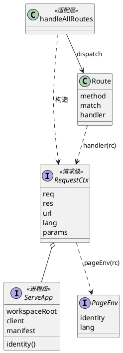

# handler-context：参数团与上下文类型未统一 —— RUP 分析与设计

> 范围：`packages/quay/src/serve*.ts`（web UI）、`cli/*.ts`（CliCtx）、`mcp-handlers.ts`（ConnectedProvider）。只读分析，未改任何源码。
> 标注：**【实测】** = 本轮用脚本/grep 取到读数（脚本 /tmp/hc-scan.mjs、/tmp/hc-clusters.mjs，函数体文本扫描，不含箭头函数/const 函数）；**【假说】** = 推断，写明「若为假会看到什么」。
> PlantUML 三份图（`handler-context-{current,proposed,seq}.puml`）**未渲染校验**（本机无 java/plantuml），仅检查了 @startuml/@enduml 与花括号配对。

## 1. 现状

### 1.1 上下文类型的定义与字段（【实测】）

| 类型 | 位置 | 字段 | 生命周期 |
|---|---|---|---|
| `ServePageCfg` | serve-render.ts:1105 | `workspaceRoot`、`identity?`、`lang?` 三个字段 | workspaceRoot 构造即定；identity 进程级但**晚绑定**（serve.ts:694 创建时为 `null`，serve.ts:817 listen 后 `routeCfg.identity = serveIdentity(...)` 原地改写）；lang **每请求不同** |
| `ServeIdentity` | serve-render.ts:1084 | 8 个字段（projectName/projectRoot/host/port/hostname/两个 pluginVersion/branches） | 进程级，只读展示 |
| `CliCtx` | cli/context.ts:14 | `argv, sub, rest, flags, positional, wantsJson` | 每次命令调用；全部由 argv 派生（bin/quay.ts:172 一次构造） |
| `ConnectedProvider` | mcp-handlers.ts:24 | `{id, client}` | 每 provider 一次，缓存在 Map（mcp-server.ts:315） |

关键事实：**`ServePageCfg` 只有 3 个字段**，它之所以被 27 个函数（14 个文件）当参数，是因为它是「cfg」这个万能口袋，而不是因为它很胖。

### 1.2 字段 × 函数使用摘要（【实测】，32 个 serve handler，不含 handleAllRoutes/handleHealth）

- `workspaceRoot`：函数体提到的 28/32（几乎处处）。例外：handleAdrList/handleAdrDetail（走 client）与 handleFanInLogView/Download（整个 cfg 转交给内部函数，间接使用）。
- `lang`：25/32 直接读；不读的 7 个为 handleBoard（整 cfg 转交 renderBoardResponse）、handleSend、handleSessionDownload、handleFanInLog*（3 个）、handleDriverLifecycle。
- `identity`：仅 14/32 直接读（handleDashboard、handleLive、handleJournal、handleSystem、handleManager、handleTaskList、handleTests、handleGitHistory、handleGoalList、handleDocList、handleNeedsHuman、handleArchitecture、handleSessions、handleAdrList）；**个别函数才用**。
- `req`：函数体**从未提到 req 的有 24/32**（含参数名 `_req` 的 handleBoard）。读 req 的只有 handleDashboard/DashboardCards（`req.url`，serve-dashboard.ts:153，而 url 已由分发器解析）、handleSend 与 sessions 的三个 POST 路由（`req.on` 读 body、`req.headers`）。直接证据：测试以 `{}` 充当 req 调 handler（serve-task.test.mjs:96，serve-board.test.mjs:808，serve-goal-body-i18n.test.mjs:312）。
- `manifest`：handleDashboard 函数体除签名外**零引用**；handleBoard 参数名为 `_manifest`；真正读的只有 handleTaskList（serve-task.ts:517 的 `manifest.id`）与 handleNeedsHuman（:272 转交渲染）。
- 请求作用域的重复劳动：`new URL(req.url…)` 在 serve.ts:713 与 serve-handlers.ts:61 各解析一次，dashboard 又第三次（serve-dashboard.ts:153）；`res.writeHead(…, text/html; charset=utf-8)` 字面量出现 23 处，JSON 仅 `writeJson` 一个收口（serve-http-json.ts:17）。

### 1.3 「同组参数反复一起传」清单（【实测】，按函数声明的参数名集合）

| 参数团 | 函数数 / 文件数 | 例 |
|---|---|---|
| `req,res`（Node 原生对） | 32 / 14 | 几乎所有 handler |
| `cfg,req,res` | 31 / 14 | handleLive、handleSystem、handleArchitecture… |
| `cfg,req,res,url` | 10 / 7 | handleDocList、handleGitHistory(Json)、handleTests、handleSessionEarlier |
| `cfg,client,manifest,req,res` | 4 / 4 | handleDashboard、handleAllRoutes、handleNeedsHuman（+handleTaskList 带 url 共 6 参数，见 serve-task.ts:29） |
| `identity,lang`（渲染对） | 10 / 8 | renderArchitecturePage、renderBoardPage、renderLivePage、renderSystemPage、renderGitHistoryPage… |
| `lang`（单独，带 `= DEFAULT_LANG` 默认） | 85 个函数带 `Lang` 类型；默认值写法 76 处 | renderSiteNav、pageTitle、phaseLabel… |
| `ref,root,taskId` / `client,root`（observation、board/dashboard 快照） | 3–4 / 2 | readTaskStatusAtRef、buildDashboardSnapshot — **非 serve 上下文问题**，不在本设计范围 |

按类型找：`ServePageCfg` 27 函数/14 文件；`ServeIdentity` 14/10；`ProviderClient` 21/9；`Manifest` 6/5（与 ArchGuard 的 26/9/19 同量级，差异来自统计口径，ArchGuard 含箭头函数）。`CliCtx` 在函数声明参数里只显示 2 处，因为 **CLI 侧全部用解构参数** `({sub, rest}: CliCtx)`（cli/ 下 25 处解构），所以按「参数名集合」找不到它。解构字段频次：sub 15、positional 13、flags 13、wantsJson 12、rest 12、argv 2。
`ConnectedProvider`：mcp-handlers.ts 里 21 处 `await getClient(...)`，19 处写成 `const { client } = …`，2 处丢弃结果；**`id` 在这些站点从未被读**（仅限 mcp-handlers.ts，别处未查）。`(id)=>Promise<ConnectedProvider>` 的函数类型在 mcp-handlers.ts 重复书写 ≥7 次。

## 2. 分析类（RUP boundary / control / entity）

- **boundary**：HTTP page handler（32 个）——把 HTTP 请求翻译成「读模型 + 渲染 + 写 res」；CLI 命令 handler（`handleGate` 等）——把 argv 翻译成领域调用并 `console.log/process.exit`；MCP `register*Handlers`——工具调用面。三者是**三个互不相通的 boundary 族**。
- **control**：`handleAllRoutes`（路由分发 + 语言解析 + 响应头 + 404），约 296 行、约 30 个分支，**顺序即语义**（`/session/:id/earlier` 必须先于 `/session/:id`；POST `/send` 不能被 POST 拦截块吞掉）；serve.ts `requestHandler`（/health、/favicon 先行）。
- **entity / view-model**：ProviderClient、Manifest、各 `XxxResult` 数据、ServeIdentity。
- **共同协作者**：provider client（读任务）、observation.ts（读 git/loop 文件）、serve-render.ts 的 chrome（site nav/页面标题/语言标签）、serve-lang.ts。

**ServePageCfg 混了三种关注点【实测 + 部分假说】：**

1. 进程级配置：`workspaceRoot`（实测，常量）。
2. 进程级但晚绑定的依赖：`identity`——创建为 null，listen 后原地改写（实测 serve.ts:694/817）。结果：所有 handler 读到的是**可变共享对象**，且类型是 `identity?: … | null`，每个渲染调用都要处理「未接入」分支。【假说】这是为了拿到真实监听端口（`--port 0`）；若为假，serve.ts:817 附近的注释不会提到 port。
3. 请求级输入：`lang`——分发器用 `{...cfg, lang}` 做浅拷贝（serve-handlers.ts:86）以避免串请求；这个拷贝是**为了在进程级对象上夹带请求级字段而必须做的防御**。`lang?` 可缺省且渲染函数默认 `DEFAULT_LANG`（76 处），源码注释已把它记为「静默默认语言陷阱（硬规则 3b）」（serve-handlers.ts adrM 分支、serve-goal.ts、serve-tests.ts 的 ROW 20 注释），并出现过多次因 cfg 类型过窄（`{workspaceRoot}`）而漏传 lang 的修复。
4. 完全不在 cfg 里的：`client`、`manifest`（依赖注入，进程级）、`req/res/url`（请求级）——于是又在每个签名里与 cfg 并排传，形成 `(cfg, client, manifest, req, res, url)` 的参数团。

**结论【实测支持】**：混了。进程级（root、client、manifest、identity）与请求级（req、res、url、lang）被拆成「cfg 带一点 + 其余各自传」，没有一个类型对应一个生命周期。另有遗留形态 `ServePageCfg | string`（serve-goal.ts:533/792）说明签名曾多次被迫放宽。

**CLI 侧**：CliCtx 的 6 个字段都是 argv 派生（`positional`、`flags` 与 `rest` 同源，冗余但自洽），没有 root、没有 provider、没有输出句柄；工作区根靠 `process.cwd()` 隐式获取（cli/ 下 10 处，其中 goal.ts:109/116、server.ts:130）。它是**健康的参数对象**，没有被混杂。命名提示：bin/quay.ts 里还有另一个 `ctx`（`run(argv, ctx)` 的 `{capture,cwd,env}`，bin/quay.ts:66），与 CliCtx 同名不同物。

## 3. 设计元素与方案比较

| 方案 | 做法 | 优点 | 缺点 / 风险 |
|---|---|---|---|
| (a) 参数对象 | 把 `{req,res,url}` 之类打成一个接口 | 改动小 | 不分生命周期，只是把口袋换成更大的口袋 |
| (b) 请求上下文类 | `class RequestCtx` 持有 req/res/url，方法 `sendJson/redirect/lang` | 调用点短 | 这里没有需要封装的可变状态或继承；方法依赖 `this`，测试要 new 对象，tree-shaking 差；**为用类而用类** |
| (c) 拆两层 | `ServeApp`（进程级：root/client/manifest/identity）+ `RequestCtx`（请求级：req/res/url/lang/params） | 一个类型对应一个生命周期；消除 `{...cfg, lang}` 拷贝；identity 可变性被封进 `identity()` | 需要适配层；类型文件新增 |
| (d) 路由表 + `(rc) => …` | 用 `routes: Route[]` 替代 296 行 if 链，handler 统一单参 | 签名统一；路径参数 `params` 一处解码（现在 `decodeURIComponent` 在分发器里出现 11 次，其中 session/fan-in-log 的 4 个路由块各自手写 try/catch 回退） | 顺序语义必须原样保留；错误回退行为（畸形 %-转义）要保持 |

**推荐：(c) + (d)，辅助函数用普通函数而非类，并加一个只含 `{identity, lang}` 的 `PageEnv` 给 render 层。** 理由：TS 里「一个值对象 + 自由函数」比类更利于测试（现有 14 个测试文件已用字面量 cfg 和假 res 直调 handler）；类只在有不变量要维护时才有价值，这里没有；render 层不应看见 req/res，`PageEnv` 把 10 个 `(identity, lang)` 对收成一个必填值。

提议结构（精简示意；完整图见 `handler-context-proposed.puml`，现状见 `-current.puml`，请求时序见 `-seq.puml`）：



```ts
// serve-context.ts（草案，不进源码）
export interface ServeApp {                 // 进程级，构造后不变
  readonly workspaceRoot: string;
  readonly client: ProviderClient;
  readonly manifest: Manifest;
  identity(): ServeIdentity | null;         // 吸收「listen 后才绑定」
}
export interface RequestCtx {               // 请求级，每请求新建
  readonly app: ServeApp;
  readonly req: IncomingMessage;
  readonly res: ServerResponse;
  readonly url: URL;                        // 只解析一次
  readonly lang: Lang;                      // 必填：缺省不再静默变 en
  readonly params: readonly string[];       // 路由捕获组，已 decode
}
export interface PageEnv { readonly identity: ServeIdentity | null; readonly lang: Lang }
export const pageEnv = (rc: RequestCtx): PageEnv => ({ identity: rc.app.identity(), lang: rc.lang });
export function sendHtml(rc: RequestCtx, html: string, status = 200): void { /* writeHead + end */ }
export function redirect(rc: RequestCtx, location: string): void { /* 302 */ }
export type Handler = (rc: RequestCtx) => Promise<void>;
export interface Route { method: "GET" | "POST"; match: string | RegExp; handler: Handler }
```

页面 handler 变成 `taskListHandler(rc)`，需要读 body 的 POST handler 才碰 `rc.req`。`ServePageCfg` 标记 deprecated，保留为适配层输入。

**CLI 是否共享抽象？不共享，保持分离。** 字段无交集（CliCtx 无 root/client/res，serve ctx 无 argv/flags）；共享会逼出一个只含 `workspaceRoot` 的空泛基接口，得不到任何复用。可选的后续小改动（【假说】）：给 CliCtx 加 `root`，替代 10 处 `process.cwd()`；若为假（即 cwd 在 `withProvider` 里被改写），则 cli/shared.ts `withProvider(…, {root})` 已经是正确的收口，无需动 CliCtx。
`ConnectedProvider`：`id` 无读者，低价值；只建议给重复 7 次的函数类型起别名，**不并入本设计**。

## 4. 迁移方案

**原则**：行为不变，逐簇迁移，每步都能独立回滚；公开导出名与签名在迁完前不动。

0. **先立特征化基线（目前不存在，需新建）**：对固定 fixture workspace，把每条路由 `?lang=en/zh` 的响应体与头存快照。若迁移后快照有差异，则说明不是纯重构。
1. 新增 `serve-context.ts`（仅类型 + sendHtml/redirect/notFound）。只 `import type`，避免 import-graph ratchet 的新环（存量记忆：valueSccs 基线为 0）。
2. 新增 `serve-router.ts`：`routes` 数组 **按现有 if 链顺序**逐条搬运（含 POST 拦截三条、`/` 302、`/git` 302、`/send` POST）。`handleAllRoutes(req,res,client,manifest,cfg)` 保持导出，内部先构造 `ServeApp`/`RequestCtx` 再 dispatch ——这就是**适配层**。`resolveLang` 仍只在构造 RequestCtx 处调用一次（现有静态断言「grep resolveLang 只有 import + 一处调用」要保持）。
3. 迁 handler，按参数团从简到繁：① `(cfg,req,res)` 10 个（Live/Journal/System/Manager/Architecture/Sessions…）；② `+url` 5 个；③ `+client,manifest` 4 个（顺手删除 handleDashboard/handleBoard 的死参数 manifest）；④ handleTaskList（6 参数，507 行，只改签名与取值，函数体搬运不重写）；⑤ 带 id 的详情页（`params[0]` 取代位置参数）；⑥ POST 路由（读 body）最后。
4. 每个旧导出 `handleXxx(req,res,cfg,…)` 变成一行包装：由 cfg 合成 RequestCtx 再调新 handler。**14 个测试文件直调这些导出（假 req `{}`、字面量 cfg），包装保证它们不动**；全部调用方迁完后再删包装。包装里 `lang` 缺省补 `DEFAULT_LANG` 以保持旧行为，这是适配层唯一允许「静默默认」的地方。
5. render 层：10 个 `(identity, lang)` 函数改为 `(data, env: PageEnv)`，旧签名保留一轮。
6. serve.ts：`routeCfg` 的原地改写换成 `identity()` 闭包；`/health`、`/favicon` 暂留原处。

**会受影响的现有测试**（packages/quay/test/）：直调 handler 的 14 个 —— serve-task.test.mjs、serve-board.test.mjs、serve-sessions.test.mjs、serve-goal-body-i18n.test.mjs、serve-live-body-i18n.test.mjs、serve-needs-human-body-i18n.test.mjs、gap-webui-goal-list-sort-and-column-set / -tab-split-goal-ac / -full-id-status-title、gap-webui-goal-detail-no-entity-links、gap-webui-goal-task-rollup-via-shared-summary-cache、gap-webui-list-table-no-overflow-container、gap-dashboard-goal-card-ac-denominator-includes-superseded-retired、observation.test.mjs；经 HTTP 驱动的：serve.test.mjs、serve-handlers.test.mjs、serve-lang.test.mjs、serve-lang-switcher.test.mjs、serve-i18n.test.mjs、serve-tests-body-i18n.test.mjs 及 `startServer`/`serve.ts` 相关约 88 个文件（粗口径，grep 命中）。全量入口只用 `scripts/test.sh`。另需 `ts-typecheck` 与 build-dist（scripts/build-dist.mjs 按文件名引用 serve-handlers.ts）。

**风险**：
- 路由顺序/回退语义（畸形 %-转义回退为原始段、POST 未命中时落到 GET 匹配器）——靠特征化基线与 `serve-handlers.test.mjs` 兜住。
- 把 `lang` 改必填会暴露历史上漏传的站点：这是**目的**，但一次性改会让 CI 变红；用适配层分步收紧。
- 新增文件落入 build-dist / loop-shipping / catalog 的各类静态登记（见仓库记忆里的「新增 plugin 脚本需 catalog 行」类陷阱；packages/quay/src 是否有同类登记【未查】）。
- 迁移与活跃的 serve 相关任务在同一批文件上冲突（Touches 重叠）；应拆成按簇的小任务。

## 5. 开放问题（需人拍板）

1. **范围**：是否只做 (c)+(d)（serve 侧），还是同时动 render 层的 `PageEnv`（10 个函数，收益是消灭 identity/lang 对，代价是动 serve-render.ts 这个全员依赖文件）？
2. **lang 必填的收紧节奏**：新 ctx 立刻必填、适配层兜旧行为，还是等全部旧导出迁完再收紧？（涉及硬规则 3b 的「静默默认」是否允许在适配层残留。）
3. **旧导出何时删**：14 个测试直调旧签名。是保留包装长期存在，还是同批把测试改用 `makeTestCtx()` 夹具（测试改动量大，但 req 用 `{}` 的做法会消失）？
4. **路由表粒度**：是否借此把 `routes` 做成可被静态检查读取的数据（供「每条路由有 i18n/测试」类检查使用），还是仅做内部重构？前者属新机件，需先给出「已发生几次」的需求读数（硬规则 12）。
5. **CLI 侧**：同意「保持分离」并只在需要时给 CliCtx 加 `root`？还是把 `process.cwd()` 的 10 处隐式依赖列为独立任务？另外 `run(argv, ctx)` 与 `CliCtx` 同名是否改名（纯文档/命名）？

## 附：证据口径与局限

- 函数清单来自 `function` 声明的文本扫描；箭头函数、类方法、`const f = (…) =>` 未计入，故与 ArchGuard 的 26/9/19 有出入。
- 「函数体提到 req/identity/lang」是**词法提及**（含注释），所以 `req0` 是可靠下界，`id1/lang1` 可能略高估；通过整 cfg 转交给 helper 的间接使用不计为直接读取（handleBoard、handleFanInLog*）。
- 未读：handleTaskList 507 行函数体细节、各 render 函数内部、handleGate/handleInit 的出度来源（仅看了 handleGate 开头）。对它们的断言仅限签名层面。
- 若「ServePageCfg 混杂生命周期」这一结论为假，应看到：identity 在 listen 前就有值且从不被改写（serve.ts:694/817 与此不符，故当前判为成立）。
