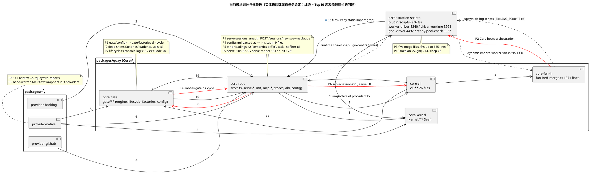
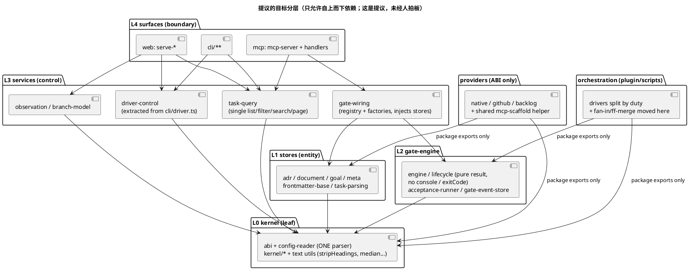

# 其余模块设计巡检（RUP 分析与设计）

范围：packages/quay 的 gate / cli / kernel / fan-in / core-root 其余文件、三个 provider、plugin/scripts 最大 5 个文件。只读分析，未改任何源码。
标记约定：**[实测]** = 读到源码或脚本产出的计数；**[假说]** = 推断，附「若为假会看到什么」。

## 0. 证据口径

- 依赖边：自写提取器（/tmp/ms-edges.mjs，按【行首】的 `import`/`export … from`/`import()` 判定，注释里的提及不计）。packages/quay/src 得到 112 文件 / 353 条相对 import。
- 零计数自检：文件级强连通分量（SCC）检测先对一个人造 a.ts<->b.ts 环干跑，报出 2 节点环，谓词有效；随后在 packages/quay/src 与 plugin/scripts（288 文件、770 条边）上都得到 SCC = 0。
- 因此下文的「循环」一律区分：**目录级循环**存在；**文件级循环**在这两处都不存在。
- 本文边数有两套口径：任务给定的是实体级（图中用它）；我测的是文件级 import 行数（正文用它，会标明）。
- 被我否定的误报：observation.ts 里 3 处 `serve-i18n` 只在注释中，不是 import。
- 未渲染校验：本机无 java/plantuml，两张图只用基础语法，逐行人工自检，未实际渲染。

## 1. 逐模块清单

### 1.1 packages/quay/src/gate/**（26 文件，约 3000 行）

(a) 职责：门定义与注册（registry 110）、门执行与记账（engine 134）、生命周期转移 complete/promote/retreat/adjudicate（lifecycle 552）、验收脚本执行与超时/成本账本（acceptance-runner 421）、GateEvent 追加/查询（gate-event-store 109）、gates.yml 解析与诊断输出（config/loader 473）、8 个门工厂（factories）、暗轴记录判定（dark-axis-record 265）、旧的 `quay run` 循环（driver 156）。

(b) 角色：engine = control；lifecycle = control（但混入 boundary：console.log）；gate-event-store/GateEvent = entity；registry = control（工厂注册）；config/loader = control + boundary（诊断 sink 写 stderr）；dark-axis-record = entity 判定器（纯函数，好）；factories/* = control，其中 adr/goal/document-contract 直接依赖具体 store。

(c) 问题：
1. **[实测] 目录级三角循环**：registry→factories/{document-contract,goal}（registry.ts:7-8）；factories→gate、config（15+5 条）；config/loader→factories/index（loader.ts:13）、config/loader→types。文件级无环，因为 `gate/types.ts` 被刻意做成叶子（types.ts:17 注释）。严重度：低，已被「叶子文件」技巧压住，但目录边界不真实。
2. **[实测] 两个零引用死 shim**：`gate/factories/loader.ts`（17 行）与 `factories/utils.ts`（5 行）在 packages/ 与 plugin/ 的源码里只被注释提到（grep 3 处均为注释），只在 dist/quay.js 里残留。它们贡献了 factories→config 的 3 条边。严重度：低，删除即可。
3. **[实测] 库层做表现层副作用**：lifecycle.ts 有 13 处 `console.log`、8 处 `process.exitCode =`（如 :148-151、:186-189），每处都带重复的 `@deprecated` 注释；MCP 侧在 mcp-handlers.ts:371/722/789/826 四处手动 `process.exitCode = 0` 擦屁股。返回值已含 exitCode，副作用是冗余。严重度：中，见 Top 10 第 7。
4. **[实测] Core 内硬编码本仓方法论**：lifecycle.ts:132 `/^ADR-007$/i`——「声明了 ADR-007 就强制暗轴记录」是本项目的约定，却写进"与 provider 无关"的 Core 生命周期里。严重度：中。
5. **[实测] 静默失效被作者自述**：lifecycle.ts:123-126 承认 gates 段 YAML 语法错会被读成「未声明 ADR-007」，强制静默关闭（硬规则 3b 的典型）。严重度：高（并入 Top 10 第 4）。
6. **[实测] 命名撞车**：`gate/driver.ts`（QENG-4 `quay run` 循环，仅 cli/run.ts 与至少 9 个测试引用）、`cli/driver.ts`（supervisor CLI）、plugin 里的 *-driver 三者都叫 driver。
   **[假说]** `quay run` 在生产里已无人用（真正的循环是 plugin 驱动）；若为假，会在 .quay 的 gate-events 中看到 actor=`quay-cli` 且由 run 触发的事件。严重度：低。
7. **[实测] registry.ts 无类型**：`var gateRegistry`、`registerDocumentGate(gateName, docDir, docId)` 无任何标注，而同目录其余文件都有。严重度：低。

(d) 未读：factories 各文件正文（除 index/loader）、engine/gate-log/gate-event-store 正文、dark-axis-record 逻辑、config/loader 的 CST 解析器（156-266）与诊断 sink（39-98）只看了标题。

### 1.2 packages/quay/src/cli/**（26 文件，约 3900 行）

(a) 职责：命令分发的 handler（每个子命令一个文件）、flags 解析、共享的 provider 连接（shared.ts）、help 文本（help 565）、init 向导（cli/init 307）、server/driver 进程生命周期（server 902、driver 337）。
(b) 角色：全部是 boundary（handler）；`cli/context.ts` = entity（CliCtx DTO，被 20 个文件引用）；`cli/shared.ts` = control（withProvider/withGuardedErrors，被 19 个文件引用）；`cli/server.ts` = boundary + control（启停进程、读写 carrier）。
(c) 问题：
1. **[实测] 巨函数**：`printHelp` 508 行（一个函数装整个帮助文本，实为数据）；`lifecycleCommand` 285 行、`statusCommand` 129 行（均在 server.ts）；`handleInit` 284、`handleTaskEdit` 179、`handleTaskList` 157、`handleGate` 143。严重度：低到中。
2. **[实测] 头注释与代码矛盾**：cli/server.ts 头部（:1-30）声称「只实现 status，start/add/stop 是 stage B 未实现」，而 :156 导出 `SERVER_VERBS = [start, add, stop, restart, status]`，:587 有 285 行的 lifecycleCommand。严重度：低（但这是读者第一眼看到的文本）。
3. **[实测] 业务过滤重复**：cli/task-list.ts:69-93 的 prefix/label(AND)/search 过滤，在 mcp-handlers.ts:222-243、serve-task.ts:139 与 :369 各写一遍，且 CLI 带 sort/page-size，MCP 无 sort。见 Top 10 第 5。
4. **[实测] 被 Core-root 反向引用**：serve-sessions.ts:20 `import { runDriver } from "./cli/driver.ts"`，serve.ts:50 引 `cli/driver-vocab.ts`。后者是 49 行叶子，合理；前者把一个 CLI handler 当服务用。严重度：中（并入第 6）。
5. **[实测] cli/driver.ts 同时 import fan-in/ff-merge（:37 的 `probeInstruments`）与 observation**，并通过 plugin-root 去 spawn plugin 脚本。CLI 层与编排层交织。
(d) 未读：除 task-list、server 头部与 driver 的 import 外，其余 handler 正文未读；help.ts 只读了函数边界。

### 1.3 packages/quay/src/kernel/**（7 文件，约 800 行）与 fan-in/ff-merge.ts

kernel (a) 职责：control-state 读写与调用者识别（232）、HTTP 控制面宿主（279）、进程 cmdline 识别（117）、原子写 JSON、env 合并、regex 转义、shape 节名常量。
(b) 角色：control-state = entity + 操作；control-plane-http = boundary；其余为纯工具。
(c) **[实测] 这是整个仓库里最干净的一层**：kernel 内部唯一的相对 import 是 control-state→write-json-atomic（grep 全部 `from "."` 仅此一条）；root→kernel 7 条、provider-native→kernel 2 条，没有反向边；plugin/scripts 里 10 个文件引 proc-identity，plugin 侧还专设 `plugin/scripts/regex-escape.ts` 作入口（其头注释解释了「kernel 是 packages 与 plugin 双方都能到达、且不产生 packages→plugin 反向边的唯一位置」）。这是**项目自己已有的正确去重模式**，下面的复制粘贴问题应沿用它。
(d) 未读：kernel 各文件正文。

ff-merge.ts (1071 行，单文件)：
(a) 职责（按 :50-1071 的节划分共 12 项）：类型；spawn/git 小工具；git-common-dir；L1 token 闸；AC78 agent-id 校验（读 `~/.claude/projects/...`，:155）；运行时产物清单；clean-tree 处理（含自动提交 tasks/*.md 状态翻转，:193-310）；sibling 脚本解析（dev .ts / dist .js，:326-388）；flip-done 短路；suite 证书闸（:558）；merge 锁；delta 分类；instrument 探针（:678-770）；主流程 `ffMerge` 205 行（:791）；argv CLI main（:997-1071）。
(b) 角色：control；末尾 CLI main = boundary；`FfMergeResult`、锁/重试/升级三份 jsonl = entity 载体。
(c) 问题：
1. **[实测] 方法论泄漏进 Core**：Core 自称"与 provider 无关的任务板"，ff-merge 却写死 tasks/*.md 约定、"promotion-driver 翻转"提交信息（:232）、Claude Code 会话目录（:155）、5 个 plugin 脚本名（SIBLING_SCRIPTS :373-384）。严重度：高（Top 10 第 2）。
2. **[实测] 方向颠倒**：它的唯一非测试使用者是 plugin/scripts/worker-fan-in.ts（:331、:2133 动态加载）和 cli/driver.ts 的 `probeInstruments`；却放在 Core，再由 Core 去 spawn plugin 的兄弟脚本。静态上 Core→plugin 零 import（实测），但运行时靠 spawn 形成 Core↔plugin 的隐式双向依赖。
3. **[实测] 头注释失真**：:5-8 说它被 `quay task fan-in`（cli/task-fan-in.ts）import；cli/ 下没有该文件，`quay.ts` 里也没有 fan-in 命令。严重度：低。
4. **[实测] 可测性**：多处 `spawnSync` 直调 git，`sh/git` 是文件私有函数，无注入点（`cleanTreeCheck` 118 行、`ffMerge` 205 行）。严重度：中。
(d) 未读：:330-1071 除 :373-388 外只读了函数边界与节标题。

### 1.4 core-root 其余文件

| 文件 | 行 | 职责 | 角色 | 主要发现 |
|---|---|---|---|---|
| serve-i18n.ts | 2779 | EN/ZH 标签字典 | entity（数据） | **[实测]** 80 个 export 行（任务给的 33 是实体口径）、仅 2 个非导出常量；注释 1439 行占 52%；`{ en:` 行 390 条；15 组 `xxxLabelsFor`+`xxxLabel` 访问器，其中 `unknown … key` 的 throw 模板 14 份（:88、:736、:802…）。是「数据表 + 同一访问器抄 15 遍」，非逻辑膨胀。严重度：中 |
| serve-render.ts | 1317 | HTML 工具、CSS 字符串、Markdown 渲染、导航、页面身份与版本读取、ServePageCfg 类型 | boundary（view）混杂 | **[实测]** fan-in 15、fan-out 5；`pageStyles()` 89-505 约 417 行 CSS 放在 TS 字符串里；`readDeliveredPluginVersion/readInitStatePluginVersion`（:1193-1220）在视图文件里读磁盘；`Manifest` 类型在此重新定义（:844），与 abi.ts:133 同名不同源。严重度：中 |
| serve-git.ts | 1201 | git 图布局算法 + SVG 常量 + 内联前端 JS + HTTP handler + JSON | boundary+control+entity | **[实测]** `gitGraphClientScript` 389 行的 JS 在 TS 字符串里（:467）；`layoutGitGraph/assignGitColumns` 是纯算法却与 handler 同文件。严重度：中 |
| serve-sessions.ts | 772 | 会话页、会话下载、fan-in 日志查看、driver 启停、新建/恢复会话（spawn） | boundary+control | **[实测]** 四类职责；`spawnSession`（:651）在 HTTP handler 文件里直接 `spawn(..., {detached:true})`；见 Top 10 第 1 |
| serve-tests.ts | 1180 | 测试页：数据读取 + SVG 渲染 + handler | boundary | **[实测]** `readSuiteLoadSamples`（:42）直接读盘，与 6 个 SVG 渲染函数同文件；无重复。严重度：低 |
| init.ts | 1721 | 配置分类/迁移/生成、运行 init、打印指引、手写 YAML 折叠 | control+boundary | **[实测]** 6 处独立 `YAML.parse(readFileSync(cfgPath))`（:74、:1195、:1267、:1446、:1670 及 `parseDocument` :203）；`pyYamlDump`/`foldPlainScalars`（:1111-1190）手写 YAML 输出；`generateConfigContent` 176 行模板、`runInit` 201 行、`migrateStaleMcpEntry` 154 行。严重度：中 |
| abi.ts | 135 | Task/Adr/Goal/Meta/Manifest 类型、TASK_STATUS | entity | **[实测]** fan-in 18、fan-out 0，是事实上的共享内核，却放在 root；gate 对它的 10 条依赖是合理方向，应整体下沉到 kernel |
| config.ts | 77 | findConfig/loadConfig/readLoopConfig | control | **[实测]** 77 行小而对，但**不是**唯一读取点（见 Top 10 第 4） |
| mcp-server.ts / mcp-handlers.ts | 584/1131 | 3 个 Core 自有工具 + 22 个代理工具；stdio 传输 | boundary | **[实测]** `registerTaskHandlers` 436 行、`startMcpServer` 291 行；mcp-server.ts:56 import init.ts（MCP 暴露 init） |

未读：serve-dashboard、observation（范围外），上表各文件的函数体只读了抽样段：serve-i18n 1-30/1060-1090/1209-1225、serve-render 76-88、serve-sessions 555-600/651-670/716-735、mcp-handlers 196-266/697-737、init 仅函数边界。

### 1.5 三个 provider（除 createStore 外）

(a)(b) native：bin（489 行，`main` 393 行）= boundary；mcp-server（633 行，`startMcpServer` 565 行，15 个工具）= boundary；carrier-dirs = control；goal-store/meta-store 各 27/14 行 = 纯 re-export shim。github：mcp-server 371 行（11 工具）、manifest 41。backlog：mcp-server 120 行（6 工具，只读）、manifest 41。
(c) 问题：
1. **[实测] manifest.ts 的"三份"是有意复制，不是缺陷**：backlog 与 github 的 manifest.ts 代码行（:29-41，13 行）逐字相同，仅 3 行注释不同；native 的是 18 行参数化版本。文件头（:5-27）写明理由（无 quay 依赖的 ABI-only provider + SEA 打包缝），并指向 docs/analysis/provider-manifest-reader-is-a-per-package-copy.md。**我不建议动它**。但有一处自相矛盾：头注释说「本包不声明 quay 依赖」，同文件 :33 却 `import type … from "../../quay/src/abi.ts"`（相对路径越包）。
2. **[实测] mcp-server 样板重复**：三份各自含相同的 11 行 `provider://manifest` 资源注册（native:98-111、github:26-39、backlog:24-38；最长连续相同段 11 行）；`type: "text"` 手写包装 native 31 处 + github 18 处 + backlog 7 处 = 56 处，无 `ok()`/`fail()` 辅助；adr_* 在 backlog 与 github 各有 3 个「不支持」桩。
3. **[实测] 注释自相矛盾**：native/mcp-server.ts:13-16 写「Goal store 是 PROVIDER-OWNED，schema 在 quay-native，不在 Core」，而 native/src/goal-store.ts:4-10 的 27 行 shim 明说实现在 Core（`quay/src/goal-store.ts` 3411 行）。两条注释至少一条过期。
4. **[实测] 越包相对路径**：native 的 src 里有 14 处 `../../quay/src/...`（store.ts 一个文件就 6 处：abi、task-parsing、store-commit、goal-ac-write-face、kernel/regex-escape、kernel/shape-sections；mcp-server.ts 2 处直取 gate/acceptance-runner 与 gate-event-store），同时又用包导出 `quay/adr-store`（mcp-server.ts:10）。两种引用风格并存；quay 的 exports 只开放 4 个子路径。
5. **[实测] 近同名的 mcp-server 不是跨包复制**：native vs Core mcp-server 最长连续相同段仅 4 行；真正复制的是 `budgetedTaskListContent`（native/mcp-server.ts:45-65 与 mcp-handlers.ts:66-86，约 20 行逻辑近乎相同，常量与错误文案均重复，仅参数多一个 `scannedFiles`）。
(d) 未读：native store.ts、github-client.ts、backlog-client.ts 正文；provider.yml。

### 1.6 plugin/scripts 最大 5 个文件

读了：每个文件的节标题、顶层函数尺寸（`ms-fn.mjs`，终止于行首 `}`）、worker-driver 121-371 的 import 区、ready-pool-check 1-40 头注释。没读函数体。

| 文件 | 行/函数/导出 | 节划分（行区间）与职责数初判 | fan-out/fan-in | 备注 |
|---|---|---|---|---|
| worker-driver.ts | 5240 / 131 / 151 行 | 常量 373；纯函数 481；ff 续做识别 618；suite 锁指标 641；落地判定 678；冷启动在飞枚举 744；superseded worktree 回收 1059；续做复用 1709；静态相位归因 1942；重试上限豁免 2228；失败文件聚合仪器 2346、2722；快速死亡退避+成因分类 3050/3101；单例运行 3571；dispatch 持久记录 3608；AC 短路 3972；常驻选择环 4302；CLI 4966。**约 14 项职责** | 27 / 1 | `runResidentLoop` 603 行（:4362）、`main` 266 行 |
| driver-runtime.ts | 3991 / 121 / 164 | 自称 "Layer 0" 的节 22 个（registry 表 108、工具 233、代码根解析 384、载体观测 480、控制面宿主 619、停机登记 651/960、bundle 陈旧 1187、内存包络 1304、判停 1572、心跳 1607、出站通知 1618、profile/launchArgv 1660、环境致命签名 1733、环境冒烟 1827、异步 spawn 1884、liveness 1930、源码自刷新 2176、监视三态 2214、supervisor 陈旧 2299、版本漂移 2417、supervisor 2732）+ Layer 1a/1b（2018/2129）+ CLI 3841。**约 25 项** | 8 / 19 | 19 个文件 import 它，是 plugin 侧的实际"内核"，却叫 driver-runtime |
| goal-driver.ts | 4492 / 97 / 148 | 常量 89；goal-store 客户端 262；冻结读数 389；直接量复核 464；纯推导 812；关闭前置 877；充分性语义判定 1049；业务目标层 1311；缺口态族 1874；draft 分诊 2337；G9 缺口语义环（spawn agent）2404；充分性卡死信号 2773；一轮机械环 2999；外部视角 3644；常驻 4283；CLI 4302。**约 12 项** | 10 / 0 | `runGoalRound` 466 行（:3177）、`computeGoalGaps` 197 行 |
| meta-driver.ts | 2688 / 81 / 123 | 机械半 181；处理者路由 309；重复计数 350；时序派生 434；第七类读数 558；提案闸与落地 1070；轮末结算 1178；机制生态读数 1226；变化检测 1354；自动驱动通道 1454；probe 写入守卫 1818；决策通道 1834；语义半 2173；一轮 2295；常驻 2497；CLI 2524。**约 10 项** | 9 / 1 | 相对最均衡 |
| ready-pool-check.ts | 3937 / 108 / 100 | 信号：LANDING-BLOCKED 364、MERGE-WORKTREE 459、价值优先 616、SUITE-BLOCKING 664、COMMIT-TRACE 744、不可满足 AC 893、TOUCH-ABSENT 961、散文前置缺口 1225、连红窗口 1770；`buildCandidate` 181 行（:2259）、`analyzeTasks` 472 行（:3174）；写盘（:3697、:3816）；HEARTBEAT `--apply` 3647；CLI 3859。**约 12 项** | 21 / 5 | **头注释（:22 附近）声称"DETECTOR/RECOMMENDER，永远 exit 0，从不写 tasks/**"，而 :3697/:3816 用 writeFileSync 改任务文件、:3729 提交**——检测与变更同居一个名叫 check 的文件 |

(b) 角色：五者都是 control 与 boundary（CLI main）与 entity（jsonl 载体读写）混居；没有一个只做一件事。
(c) 共同问题：
1. **[实测] 一节一个 gap 编号的堆叠式增长**：节标题几乎都是 `(gap-xxx)`，说明每次修补都在文件尾/中追加一段，没有按职责重组。
2. **[实测] 小工具并未全部散落**：用户提到的 `repoRoot`（repo-root.ts:37，94 个文件引用）、`flagValue`（gate-script-base.ts:156）、`helpExit`（gate-script-base.ts:45；203 个文件引 gate-script-base）**各只有 1 处定义**，没有重复。（`loop-complete-task.ts:54` 的 `const repoRoot = moduleRepoRoot()` 是同名变量，不是第二份实现。）这条是**否定性结论**：这三件已治理好。
3. **[实测] 真正在重复的小工具**见 Top 10 第 10。
4. **[假说]** 这五个文件的拆分顺序应为 driver-runtime → worker-driver → ready-pool-check；依据是 driver-runtime fan-in 19，改它风险最大、收益也最大。若假：拆它后 import 它的 19 个文件需要同步改的比例会很高。

## 2. 跨模块问题

**2.1 复制粘贴（给相同行数与位置）**
- stripHeadings：serve-render.ts:77-84 与 cli/flags.ts:178-180。**行为不同**：前者保留代码围栏内的 `#` 行，后者一律剔除。使用方：cli/task-list.ts:91、serve-task.ts:139/:369、mcp-handlers.ts:236（import 来源未逐一核对，故哪边用哪版属 [假说]；若为假，三面对含围栏 `# 注释` 的正文搜索结果会一致）。
- budgetedTaskListContent：native/mcp-server.ts:45-65 ≈ mcp-handlers.ts:66-86（约 20 行，diff 52 行均为改名与文案）。
- provider://manifest 资源注册：11 行 ×3（见 1.5）。
- relativeTime（serve-render.ts:760）与 relativeTimeCli（cli/flags.ts:160）：同一需求两份，输出格式不同。
- plugin：见 Top 10 第 10。

**2.2 循环依赖**
- 文件级：Core 与 plugin/scripts 均为 0（已验证谓词）。
- 目录级：root↔gate（root→gate 10 行：goal-store.ts:71/86/87/2051/3192、mcp-handlers.ts:17-20、config-validate.ts:16；gate→root 14 行，其中 abi 10 行）；root↔cli（2 行）；gate/config↔gate/factories（见 1.1）。

**2.3 分层违例：该修还是合理**
- gate→root(abi.ts)：合理，修法是把 abi 下沉到 kernel，该边消失。
- gate→root(stores/config)：factories/{adr,goal,document-contract} 与 config/loader→config.ts:25。方向本身可接受（门依赖存储），问题在反向：goal-store 又 import gate/acceptance-runner 等。该修：把 acceptance-runner/gate-event-store/config-utils 下沉为无存储依赖的叶子，或把 factories 上提为 wiring 层。
- root→cli：serve-sessions→cli/driver 该修（抽出 driver-control 服务）；serve→cli/driver-vocab 合理。
- cli→root：合理（表现层依赖服务）。
- Core→plugin（运行时 spawn，9 个文件用 plugin-root）与 plugin→Core（19 个文件静态 import）：双向。静态上 plugin→Core 是正确方向；Core→plugin 是 ff-merge、mcp-server（runtime-usage-inventory）、serve-sessions（quay-launch.sh）等的 spawn。该修的是 ff-merge（应整体归 plugin），其余是产品与方法论的接缝，需要人拍板（见 5）。

**2.4 重复实现的小工具**：见 Top 10 第 10；Core 侧唯一的同类是 config.yml 解析（第 4）。

**2.5 巨型数据文件**：serve-i18n（数据表 + 15 套访问器）、`printHelp` 508 行、serve-render 的 417 行 CSS 字符串、serve-git 的 389 行内联 JS。共性：把"数据/资源"写成 TS 代码字符串，无法被编辑器或 linter 当作 CSS/JS/JSON 处理。

## 3. 严重度 Top 10

| # | 问题 | 证据 | 建议方向 | 严重度 |
|---|---|---|---|---|
| 1 | Web 控制面默认监听全网卡且无鉴权，可新建 claude 会话、启停 driver | serve-binding.ts:43 默认 `0.0.0.0`；serve-sessions.ts:555-598 `newSessionArgs` 只校验非空串，`permissionMode` 原样进 `--permission-mode`；:716-731 POST /sessions/new 直接 spawn；serve-handlers.ts:95-105 三条 POST 路由；`origin|csrf|Sec-Fetch` 在 serve.ts/serve-handlers/serve-sessions/serve-send 零命中（谓词用 serve-handlers:286 的 "origin" 注释验证可命中）。0.0.0.0 是人 2026-09-30 的裁定，但代码注释自己写了「无鉴权前提」（serve-sessions.ts:520） | 变更类 POST 加 Origin 校验+本地 token；permissionMode 白名单；写入需显式 `--allow-control`。**[假说]** 可被远程利用：若 quay-launch.sh 接受任意 permission-mode，则等价远程执行；若为假，会看到 launch 脚本拒绝未知模式（未读该脚本） | 高 |
| 2 | Core 反向承载编排与方法论 | ff-merge.ts 1071 行：写死 tasks/*.md（:219）、promotion-driver 文案（:232）、`~/.claude/projects`（:155）、5 个 plugin 脚本名（:373-384）；唯一使用者在 plugin（worker-fan-in.ts:2133）；lifecycle.ts:132 字面量 ADR-007；Core 另有 9 个文件（plugin-root.ts 除外）经它运行时调 plugin | ff-merge 整体迁 plugin（Core 只留 `probeInstruments` 的读口或同迁）；ADR-007 开关改为 gates 配置项而非字面量 | 高 |
| 3 | 五个 plugin 巨文件，单函数 603/655/472/466 行 | worker-driver 5240（`runResidentLoop` :4362 603 行）、worker-fan-in 2315（`runMechanicalFanIn` :1551 655 行）、ready-pool-check 3937（`analyzeTasks` 472 行；头注释称只读但 :3697/:3816 写盘）、goal-driver 4492（`runGoalRound` 466）、driver-runtime 3991（约 25 节、fan-in 19） | 按节拆：driver-runtime→{supervisor, liveness, profile, notify, version-drift}；ready-pool-check 拆 detector 与 applier（读写分离） | 高 |
| 4 | .quay/config.yml 无单一读取点，且各自 fail-quiet | `YAML.parse`/`parseDocument` 命中 config.ts:30、config-validate.ts:156、loop-params.ts:66、init.ts×6、serve-dashboard.ts:1010、gate/config/loader.ts:168（自写 CST 解析）、worktree-namespace.ts:62、observation.ts:3770，共 ≥14 处/9 文件；`".quay", "config.yml"` 路径字面量 11 处；lifecycle.ts:123-126 自述语法错 ⇒ ADR-007 强制静默关闭 | 一个 `readWorkspaceConfig()` 返回带三态（absent/valid/unreadable）的类型化对象；其余全部经它读。unreadable 不得与 absent 同形（硬规则 3b） | 高 |
| 5 | 复制粘贴且已漂移 | stripHeadings 两版语义不同（serve-render:77 vs flags:178）；列表过滤管线 ≥4 处（cli/task-list:69-93、mcp-handlers:222-243、serve-task:139/369）；budgetedTaskListContent 两份；relativeTime 两份 | 抽 `task-query`（过滤+搜索+分页+排序）与 text-utils 进 kernel，沿用 kernel/regex-escape 的模式 | 中 |
| 6 | 目录级循环与分层违例 | root↔gate（10 与 14 行 import）；root→cli 2 行（serve-sessions.ts:20）；gate/config↔factories（含 2 个零引用死 shim）；abi.ts fan-in 18 却在 root | abi 下沉 kernel；删 2 个死 shim；抽 driver-control 出 cli/driver；store 与 gate 的方向二选一 | 中 |
| 7 | 库层带表现与进程全局副作用，经 MCP stdio 暴露 | lifecycle.ts：console.log 13、exitCode 8；mcp-handlers.ts 4 处补丁式复位；:720-731 在 await 前后改写 `process.env.QUAY_ACCEPTANCE_CWD`。**[假说]** MCP stdio 的 stdout 会混入 "PASS — status=done"；若为假，则 stdout 过滤存在于未读的 bin 层。另 **[假说]** 并发 lifecycle 调用会互踩该 env | lifecycle 返回结构化结果，console 与 exitCode 只留在 cli 层；env 改为参数 | 中 |
| 8 | provider 边界多孔、注释自相矛盾、MCP 样板重复 | native 14 处 `../../quay/src/`；manifest.ts 说"无 quay 依赖"却相对 import abi；goal-store 注释 vs shim 矛盾；`type: "text"` 手写 56 处 | 开放 `quay/kernel`、`quay/abi` 导出；抽 provider-mcp-scaffold（manifest 资源 + ok/fail）；manifest.ts 保持有意复制 | 中 |
| 9 | serve-*/init 巨文件与"数据当代码" | serve-i18n 2779（52% 注释）、serve-render 1317（CSS 417 行）、serve-git 内联 JS 389 行、init.ts 1721（手写 YAML）、`startServerUnderLock` 470 行、serve-task `handleTaskList` 507 行、`printHelp` 508 行 | CSS/JS/帮助文本移为静态资源文件；i18n 用一个泛型 `makeDict` 去掉 15 套访问器 | 中 |
| 10 | plugin 小工具重复且语义漂移 | `median` ×5（空输入分别返回 null/0/NaN/0/经 pct）；`git()` ×14，其中 4 个用 shell 字符串拼接 `execSync(\`git ${args.join(" ")}\`)`（build-evidence-collector:78、build-evidence-gate:80、run-identity:98、stage-receipt:245）；`sleep` ×6；`walkFiles` 3 份本地副本而 fs-walk.ts:175 已存在；`usage` ×53、`parseArgs` ×23、`readBaseline/writeBaseline` ×4 | 补 plugin/scripts/git-run.ts、stats.ts；其余并入已有 fs-walk | 低到中 |

次要项（未入 Top 10）：cli/server.ts 头注释过期；ff-merge 头注释引用不存在的 cli/task-fan-in.ts；gate/driver.ts 与 cli/driver.ts 同名；registry.ts 无类型。

## 4. 总览图

### 4.1 当前（同 module-survey-current.puml）

### 4.2 提议的目标分层（同 module-survey-proposed.puml）

## 5. 开放问题（需人拍板）

1. **Web 控制面的暴露面**：0.0.0.0 默认是 2026-09-30 的裁定；是否接受「变更类 POST（/sessions/new、/sessions/resume、/sessions/driver、/send）必须带本地 token 或仅回环」？这会改变既有使用方式，需要你定。
2. **ff-merge 归属**：迁到 plugin（Core 不再含方法论，但 `cli/driver.ts` 的 `probeInstruments` 与 npm-pack 的 Core 单包捆绑要改），还是承认「Core = 产品 + 内置方法论」并把这条写进架构说明？二选一，目前代码两头都占。
3. **Core 与 plugin 的接缝**：运行时 spawn 的 9 处（ff-merge、runtime-usage-inventory、quay-launch.sh 等）算「受控接缝」还是「待消除的反向依赖」？决定 layers.yml 里要不要给 Core→plugin 一条显式允许边。
4. **config.yml 单一读取点**：愿意引入「三态读取器」并要求其余 14 处迁移吗？（顺带决定 unreadable 时 ADR-007 强制是 fail-closed 还是仅告警——这是行为变更。）
5. **provider 的独立性**：provider 是否允许长期依赖 Core 内部（现状 14 处相对路径），还是要开 `quay/kernel`、`quay/abi` 公共导出面？决定 provider-github/backlog 是否真能脱离 monorepo 发布。

## 6. 本次未覆盖（诚实声明）

observation.ts、goal-store/TTL/ServePageCfg/CliCtx/各 createXxx 工厂（别人在做）；serve-dashboard 等未列入范围的文件；各文件函数体除上文标明行区间外均未读；"问题是否比已发现的更严重"的结论依据见最终回复。
