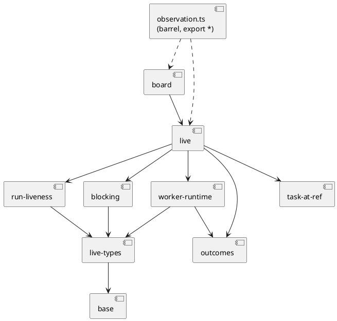

# observation.ts 职责过多：RUP 分析与设计

> 范围：只分析、只设计，源码零改动。被分析文件 `/data/home/yale/work/quay/packages/quay/src/observation.ts`（4750 行，`wc -l`）。
> 标注：**[实测]** = 本次用命令/通读得到，可复跑；**[假说]** = 推断，附「若为假会看到什么」。
> PlantUML 三张图（`observation-split-{current,proposed,seq}.puml`）**未渲染校验**（本机无 java/plantuml），仅逐行自检过 `@startuml/@enduml` 与括号配对。
> 可复跑工具：`docs/rup/observation-split-analysis.mjs`（只读；模式 counts/edges/intra/state/stateRefs/purity/usage/consumers/proposal；
> 已装 typescript 是 v7，没有 JS AST，所以用词法器：先抹掉注释/字符串/模板文本再按标识符位置匹配——注释里提到名字不算命中）。
> **前人工作**：`docs/analysis/observation-decomposition-investigation.md`（同一文件的较早快照 4671 行/197 导出）已做过消费者分组并给了 ~11 域方案；
> 本文独立复测，**结论大体一致，但发现其方案有两处会引入新环/新路障（见 4.4、4.5），并补充了「路径键控的隐藏耦合」（5.3）**。

## 1. 现状

### 1.1 分节表 [实测]（行号区间 = 本文的「节」；数字来自 `analysis.mjs counts`）

| 节 | 行号 | 行数 | 职责（一句话） | 函数(导出) / 接口 / 类型 / 常量(导出) | 模块级状态 | 外部依赖 |
|---|---|---|---|---|---|---|
| S0 共享 | 1-77 | 77 | 路径常量、`ObservationStatus`（三态 ok/empty/error） | 1(0) / 0 / 1 / 10(9) | — | — |
| S1 遥测/活动 | 78-441 | 364 | `.workflow-events` 配对出在飞任务、活动信号、LiveState 判定；Live 视图类型 | 6(3) / 5 / 3 / 0 | — | fs, `git log --since`(spawn) |
| S2 阻塞关系 | 442-624 | 183 | `## Touches` 解析 + depends_on，算 blocks/blockedBy | 6(5) / 1 / 0 / 0 | — | fs(`tasks/*.md`)、frontmatter-store-base |
| S3 worker 载体 | 625-1414 | 790 | worker-outcome/round/fan-in-lock/full-suite-state 四个 `.quay/*` 载体；`/proc` 扫活 worker；FanInAttempt | 23(17) / 9 / 2 / 5(5) | — | fs, `/proc`, `~/.claude/sessions` |
| S4 晋升出口账 | 1415-1460 | 46 | `promotion-outcome.jsonl` → needs-human 账 | 2(2) / 1 / 0 / 1(1) | — | fs |
| S5 task-at-ref | 1461-1888 | 428 | 任务 status/title/commit-time 在某 ref 上的批量读 + 后台刷新 | 23(17) / 0 / 0 / 4(1) | **3 缓存 + 4 计数器** | git spawn（show/ls-tree/cat-file/log）、abi |
| S6 readLive | 1889-2160 | 272 | `/live` 聚合枢纽 `readLive` + worker 并发上限 | 2(1) / 0 / 0 / 2(1) | — | yaml、fs、`/proc/pressure` |
| S7 journal | 2161-2400 | 240 | escalations.md / tick-log.md / 近期提交 | 8(1) / 2 / 0 / 1(0) | — | fs, git log(spawn) |
| S8 落地/执行 | 2401-2707 | 307 | `readBoardLanding`（spawn 检查脚本）、`readBoardExecution`、`/proc` 进程活性、worktree 存在性 | 10(9) / 3 / 0 / 5(3) | **1 缓存 + 1 计数器 + 1 Set** | execFile(node)、`/proc`、worktree-namespace |
| S9 git 历史 | 2708-2958 | 251 | `git log --all` 拓扑历史、decorations、remotes | 6(5) / 2 / 1 / 7(6) | **1 缓存** | git spawn |
| S10a 脚本运行器 | 2959-3042 | 84 | `runScriptBounded`/`runPluginScript`（detached spawn + tmp 文件） | 2(0) / 0 / 0 / 0 | — | spawn, plugin-root |
| S10b 系统探针 | 3043-3180 | 138 | resource-gate / process-budget 两个脚本的读数 | 4(4) / 3 / 0 / 6(6) | — | 经 S10a |
| S11 manager | 3181-3650 | 470 | loop-driver 探针、observer 注册表、pool 指标、driver 存活（动态 import kernel）、`readManager(Light)` | 15(10) / 7 / 1 / 8(6) | **2 缓存 + driverRuntimePromise/LoadError** | 动态 `import()`、spawn、fs |
| S12 测试账 | 3651-4056 | 406 | `verification-round.jsonl` → TestsResult，含分块非阻塞解析 | 11(6) / 3 / 1 / 6(4) | **1 缓存** | fs、yaml |
| S13 会话 | 4057-4645 | 589 | `claude agents --json` 列会话、transcript 尾读/全解析、会话分层状态、会话 ID 原语 | 21(13) / 7 / 4 / 10(9) | — | spawn(claude)、fs、primitives/*.mjs |
| S14 架构/分支 | 4646-4760 | 115 | `packages/*` 近期提交统计、分支模型 | 2(2) / 3 / 0 / 1(1) | — | git spawn |

合计 **274 个顶层声明** = 142 函数（95 导出；ArchGuard 的 96 含 `realGitExec` 这个箭头常量）+ 46 接口（43 导出）+ 13 类型 + 66 常量（52 导出）+ 7 `let`。
运行时可见导出 **147 个**（`Object.keys(await import(observation.ts)).length`，= 95 + 52 ✓）；另 56 个类型导出运行时不可见。
**0 个 `export let`/default/class/re-export**。模块级可变绑定 **16 个**（7 `let` + 8 `Map` 缓存 + 1 `Set`），任务给的「约 18」我复现不出：若把只读的 `NON_LIVE_TASK_STATUSES` 与 `execFileP` 也算上是 18，但它们不可变。

### 1.2 「至少 6 块职责」假说 [实测]：**成立，且低估**

- 任务给的 7 块全部命中：任务状态/标题引用（S5）、落地（S8）、git 历史（S9）、池指标与 driver 状态（S11 内）、测试/验证轮次（S12）、worker 出口记录（S3）。
- **漏列**：live/在飞聚合（S1+S6）、阻塞关系（S2）、journal（S7）、系统探针（S10b）、会话（S13）、架构/分支（S14）、晋升出口账（S4）。
- 按「一个读取源 ⇒ 一块」，实际是 **14 个读取块（S1–S14）+ 2 个横切块（S0 共享、S10a 脚本运行器）**。
- 同一个文件头自称「唯一知道 workspace 观测细节的模块」（隔离层），所以「多职责」本质是**把一整层 boundary 放在一个文件里**，而不是某个类职责混杂。

### 1.3 跨节调用矩阵 [实测]（`analysis.mjs edges`；按标识符位置、注释已抹掉）

15 节之间共 **23 条节→节边**；其中 12 条只是指向共享件（指向 S0 的常量/`ObservationStatus` 9 条、指向 S10a 的 `runScriptBounded/runPluginScript` 3 条），**真正的跨域边只有 11 条**：

| 从 → 到 | 符号（前 3 条） | 性质 |
|---|---|---|
| S6 → S3 | `LiveWorker, readWorkerOutcomeText, WORKER_ROUND_REL`…共 13 个 | 枢纽依赖载体（正常） |
| S6 → S1 | `LiveResult, InFlightTask, pairInFlight`…共 8 个 | 同域（Live 的类型与配对） |
| S6 → S8 | `classifyRunLiveness, runProcessAliveSync, taskWorktreeOpen` | **与下一行成环** |
| S8 → S6 | `readBoardExecution → readLive` | **与上一行成环** |
| S6 → S2 / S5 | `computeInFlightBlocking` / `readTaskStatusForLive` | 各 1 |
| S2 → S1、S3 → S1 | 类型 `InFlightTask`、`SuiteStateView` | 仅类型 |
| S3 → S13 | `liveSessionIdForPid → isValidSessionId` | 1 条反向小边（位置错置） |
| S8 → S1、S8 → S10b | 类型 `InFlightTask`；常量 `TASK_STATUS_DRIFT_CHECK_REL` | 常量错置在 system 节 |

- 零命中的自检：`readLive` 的函数体里没有指向 S7；`pairInFlight` 的**注释**里写了 `readLive annotates`、`classifyRunLiveness(runProcessAliveSync(runId))`，词法器没把它们算作 S1→S6/S8 边（`refs classifyRunLiveness` 只返回 `readLive`）——正样本（S6→S8 命中）与负样本（注释提及不命中）都对过。
- **共享内部辅助函数**：只有 `runScriptBounded`/`runPluginScript`（S10b、S11、S13 共用）、`isValidSessionId`（S3、S13 共用）、`jsonNum`（S10b、S11 共用）、`ObservationStatus`。除此之外各节自给自足。
- **16/16 个可变绑定只被其定义节引用**（`analysis.mjs stateRefs`，`refSections` 全为单值）⇒ 没有跨块共享可变状态。
- **强耦合块结论**：**没有「必须同时搬动」的强耦合块。** 唯一的环 S6↔S8 是一个**错置**：`runProcessAliveSync/classifyRunLiveness/taskWorktreeOpen/warnWorktreeFallback`
  只被 `readLive` 调用（`refs` 实测：`runProcessAliveSync ← readLive, isRunProcessAlive`；`taskWorktreeOpen ← readLive`），放进 board 节只是位置偶然。

## 2. 消费者 [实测]

方法：按 import 语句位置（词法器过滤注释内的 `import`），多行 import 也覆盖；与 `grep -rlE "from '…/observation'"` 交叉：**60 个文件 = 14 个生产 `.ts` + 46 个测试**（两种谓词都得 60；
`analysis.mjs consumers` 前 3 行：`cli/driver.ts | readFanInAttempts,FanInAttemptsResult`、`mcp-server.ts | readFanInAttempts`、`serve-architecture.ts | readArchitecture,ARCH_RECENT_WINDOW_DAYS,ArchitectureResult`）。另有 3 处 `await import(".../observation.ts")`（均在 `serve-board.test.mjs`）。

### 2.1 生产消费者 × 提议模块（模块划分见 4.1）

| 消费者 | 用到的模块 |
|---|---|
| `cli/driver.ts`、`mcp-server.ts` | outcomes（只用 `readFanInAttempts`） |
| `serve-needs-human.ts` | outcomes |
| `serve-git.ts`、`serve-architecture.ts` | repo（各自独占） |
| `serve-sessions.ts` | sessions + base（会话 ID 原语） |
| `serve-send.ts` | base（只用 `isValidSessionId`、`sessionTranscriptPath`） |
| `serve-tests.ts` | tests |
| `serve-system.ts` | system |
| `serve-live.ts` | live、live-types、journal |
| `serve-board.ts` | board、task-at-ref、tests（只为 `yieldToEventLoop`）、base |
| `serve-task.ts` | outcomes、worker-runtime、task-at-ref、base |
| `serve.ts` | repo（`readBranchModel`）、task-at-ref（后台刷新） |
| `serve-dashboard.ts` | live、live-types、outcomes、worker-runtime、repo、system、tests（7 个模块，扇入汇点） |

- **「dashboard 是切分轴」不成立**：它是消费 7 个模块的汇点（与前人调查一致）。
- 测试侧 46 个文件按模块计：tests 15、repo 14、system 7、live 6、outcomes 6、board 5、task-at-ref 4、sessions 4、run-liveness 4、journal 3、worker-runtime 3、base 3。
  跨 ≥4 个模块的只有 4 个：`observation.test.mjs`（9 节）、`serve-handlers.test.mjs`、`serve-ac95-views.test.mjs`、`gap-dashboard-parallelize.test.mjs`。
- 203 个导出中：**78 个没有任何按名 import 的消费者**、58 个只被测试用、50 个只有一个生产消费者文件。
  **[假说] 这 78 个可去掉 `export`**；若为假：会有测试用**字符串拼出来的 import** 引用它们——已有实例 `gap-dashboard-driver-status-card.test.mjs:313` 就在 spawn 的脚本文本里
  `import { readDriverStatus, getDriverRuntimeLoadError } from …`，我的扫描看不到这类，所以 78 是上界。
- **只被单一消费者使用的导出（可「随消费者就近放」？）**：sessions 块→只有 `serve-sessions`；board→`serve-board`；journal→`serve-live`；repo 的 history/remotes→`serve-git`、architecture→`serve-architecture`。
  **不建议真的放进 `serve-*.ts`**：文件头的隔离契约（AC1）要求 `serve-handlers`/`serve-*` 渲染层不碰 workspace 路径；且 `task-file-bypass-check` 的白名单、`session-primitives-adoption` 测试都按「observation 这一层」定位（5.3）。
  就近 = 模块名与页面一一对应（`observation-sessions` ↔ `serve-sessions`），而不是并入页面文件。

## 3. 分析类（RUP boundary / control / entity）

| 构件 | 版型 | 依据 [实测] |
|---|---|---|
| 各 `readXxx(root)`（`readLive/readSessions/readTests/readGitHistory/readSystem/readManager/readJournal/readArchitecture…`） | **boundary（只读适配器）** | 读文件/`/proc`/spawn git/spawn 脚本，把外部事实翻成视图模型；文件头契约：永不抛、`empty` ≠ `error`、读路径不写文件 |
| `readLive`、`readManager(Light)`、`readBoardExecution`、`readSessions`、`readDriverStatus` | **control（聚合）** | `readLive` 一个函数就聚合 ≥14 个外部读（events 目录、`/proc` cmdline、sessions/<pid>.json、worker-outcome、worker-round、fan-in-lock、full-suite-state、`develop:tasks/*.md`、磁盘 tasks、worktree 目录、`/proc/pressure/cpu`、drivers.yml、git log、tick-log mtime） |
| `pairInFlight/decideLiveState/computeBlockingRelations/deriveInFlightPhase/classifyRunLiveness/buildSessionLayeredState/attachValidatedSession` | **control（纯规则）** | 无 IO，可直测 |
| 46 个 interface + 13 个 type（`InFlightTask`、`LiveResult`、`WorkerOutcomeRecord`、`TestRunRecord`…） | **entity（视图模型/值对象）** | 纯数据，被渲染层消费 |
| `runScriptBounded`、8 个 TTL 缓存、5 个计数器 | **基础设施** | 缓存只服务展示面；计数器是测试可观测性 |

纯度 [实测，`analysis.mjs purity`；函数体直接 + 传递闭包上的效应标记]：143 个可调用体中 **49 纯、37 含子进程、56 含 IO、38 触及模块状态、21 读时钟、3 经动态 import**。
**盲区**：经 import 引入的有副作用函数（`readTranscriptMtime`、`resolveWorktreeNamespace`）词法器看不见，所以「纯 49」是上界（`buildSessionLayeredState` 其实读 mtime）。
纯读取+聚合：S2、S10b、S11 的 parse 层、S12 的 parse 层、S13 大半；带 spawn：S1/S5/S7/S8/S9/S10a/S13/S14；带缓存：S5、S8、S9、S11、S12。
**副作用只有 4 类**：`runScriptBounded` 写 `os.tmpdir()/ac95-script-*.out`（**这是整个文件里唯一的文件写**：对写类 API 的 grep 只命中 2992、3007、3019、3027 行，全在该函数）、分散各处的 `execFileSync("git", …)`、`/proc` 扫描（`readLiveWorkerProcesses`/`runProcessAliveSync`）、`loadDriverRuntime` 的动态 import；另有 `warnWorktreeFallback` 写一次 stderr。

**顺带发现 [实测]**：`workerOutcomeOpen()`（836-838）恒返回 `false`，所以 `workerInFlightTasks()` 恒返回空（注释自称设计如此）。属可删死分支，**不在本任务范围**。
`readTaskStatusMapAtRef` 与 `readTaskTitleMapAtRef` 各自重复一遍 `ls-tree + cat-file --batch`（`refreshDevelopRefCaches` 连调两者 ⇒ 每轮 2 次批读）；是 TtlCache 之外的另一个收益点，**同样不在本任务范围**。

## 4. 设计元素

### 4.1 模块边界（15 个模块 + 1 个 barrel；平铺 `packages/quay/src/observation-*.ts`）

行数为 `analysis.mjs proposal` 的声明区间（含前导注释），[实测] 估计；总和 ≈ 4698，barrel 另计。

| 模块 | ≈行 | 内容（节） | 公共接口（要点） | 状态/缓存归属 |
|---|---|---|---|---|
| `observation-base` | 47 | S0 残件 + 会话 ID 原语 | `ObservationStatus`、`jsonNum`、`scriptBasename`、`ORCHESTRATION_DIR`、`TICK_LOG_FILE`、`SESSION_ID_RE/isValidSessionId/projectSlug/sessionTranscriptPath` | 无 |
| `observation-exec` | 59 | S10a | `runScriptBounded`、`runPluginScript`（需新增 `export`） | 无 |
| `observation-live-types` | 138 | S1/S6 的类型 | `InFlightTask/InFlightPhase/SuiteStateView/RunLiveness/LiveState/ActivitySignals/LiveResult`（仅 type） | 无 |
| `observation-outcomes` | 380 | S3 的 outcome 载体 + S4 | `WorkerOutcomeRecord/MechanicalFanInRecord`、`parseWorkerOutcomeRecords(+Detailed)`、`readWorkerOutcomeRecords/Text`、`FanInAttempt*`、`readFanInAttempts`、`PromotionOutcomeRecord`、`readNeedsHumanLedger` | 无 |
| `observation-worker-runtime` | 444 | S3 其余 | round 载体、`/proc` 扫描（`LiveWorker/readLiveWorkerProcesses/liveSessionIdForPid`）、`workerDriverActive/OnlineMs`、`readFanInLockAcquiredTasks`、`readFullSuiteState/readCurrentSuiteRun`、`deriveInFlightPhase`、`workerInFlightTasks` | 无 |
| `observation-task-at-ref` | 422 | S5 | `readTaskStatusMapAtRef/TitleMapAtRef/CommitTimesAtRef`、`readTaskAtRefMeta/StatusAtRef/CommitTimeAtRef`、`readTaskStatusForLive`、`refreshDevelopRefCaches`、`startDevelopRefBackgroundRefresh`、`clear…`/计数器 getter | 3 个 TtlCache + 4 个计数器（原地保留） |
| `observation-blocking` | 180 | S2 | `extractTouchesSection/parseTouchPaths/computeBlockingRelations/readTaskBlockingInputs/computeInFlightBlocking` | 无 |
| `observation-run-liveness` | 125 | S8 中的活性助手 | `runProcessAliveSync/classifyRunLiveness/isRunProcessAlive/taskWorktreeOpen/resetWorktreeFallbackWarnings` | `worktreeFallbackWarned`（Set） |
| `observation-live` | 489 | S1 的函数 + S6 | `pairInFlight`、`readActivitySignals`、`decideLiveState`、`readLive`、`DEFAULT_DRIVER_CAP` | 无 |
| `observation-journal` | 288 | S7 | `readJournal`、`JournalResult/JournalSection` 与 journal 常量 | 无 |
| `observation-board` | 208 | S8 余下 + `TASK_STATUS_DRIFT_CHECK_*` | `readBoardLanding`、`readBoardExecution`、`BoardLanding/BoardExecution`、`IN_FLIGHT_TIMEOUT_MINUTES` | 1 个 TtlCache（landing）+ `landingColdRunCount` |
| `observation-repo` | 366 | S9 + S14 | `readGitHistory/readGitRemotes/GIT_HISTORY_*/realGitExec`、`readArchitecture`、`readBranchModel` | 1 个 TtlCache（git 历史） |
| `observation-sessions` | 565 | S13 去掉 ID 原语 | `readSessions/readSession/readTranscript(Tail)/parseTranscript`、`SESSION_LAYERS`、分层状态 | 无 |
| `observation-system` | 583 | S10b + S11 | `readSystem`、`readManager(Light)`、`readDriverStatus`、pool 指标、`getDriverRuntimeLoadError` | 2 个 TtlCache（pool、driver）+ `driverRuntimePromise/LoadError`（动态 import 隔离在此） |
| `observation-tests` | 405 | S12 | `readTests/readTestsNonBlocking`、`parseVerificationRound`、`detectRoundWriterPath`、`yieldToEventLoop` | 1 个 TtlCache（sync/async 共用，保持 `get/set` 而非 getOrLoad） |
| `observation.ts`（barrel） | ~20 | — | `export * from "./observation-…ts"`（15 行） | 无 |

TtlCache（另一份设计 `ttl-cache.md`：闭包工厂 `createTtlCache<V>(opts)`，字符串 key，`get/peek/set/clear`，叶子模块 `src/ttl-cache.ts`）在这里只当依赖：**每个缓存随其读取函数搬进新模块，在新模块里 `const xCache = createTtlCache(...)`**；
`clearXxxCache` 等导出名不变（函数体改成 `cache.clear()`）；计数器**不进缓存抽象**，留在计数的领域动作所在模块。两件事**解耦，可任意先后**（5.1 步骤 1–2 与缓存迁移互不依赖；若缓存先迁，只是搬运量变小）。

### 4.2 依赖方向（无环）[实测]

`analysis.mjs proposal edges` 把全部 274 个顶层符号指派到上表 15 个模块后：**value 图 SCC = 0，value+type 图 SCC = 0**。层次（最长路径）：

- L0：base、exec、outcomes、task-at-ref、tests　L1：live-types、journal、repo、sessions、system　L2：blocking、run-liveness、worker-runtime　L3：live　L4：board
- **负控制 [实测]**：设 `NO_LIVE_TYPES=1`（把类型留在 `live`）重跑，立刻出现 `[run-liveness, worker-runtime, live, blocking]` 的 type SCC ⇒ **`observation-live-types` 不是洁癖，是 `typeSccs` 棘轮（基线 0）的必要条件**。
- 需要新增 `export` 的非导出符号共 6 个：`execFileP`（建议各自本地 `promisify(execFile)`，不共享）、`jsonNum`、`readWorkerOutcomeText`、`readWorkerRoundInFlightTasks`、`runPluginScript`、`runScriptBounded`。

- **[假说] 小优化**：`yieldToEventLoop`（S12 内，被 `serve-board`、`serve-dashboard` 为「让出事件循环」而 import）移入 `observation-base` 更贴切（它与「测试账」无关）；
  这只会新增 `tests → base` 一条边，不改变无环结论。若为假：把它挪过去后 `proposal` 的 SCC 列表不再为空（我没有重跑这一变体，故降为假说）。

### 4.3 形态取舍：多文件 + barrel  vs  带状态的类/服务

| 维度 | 多文件 + barrel（推荐） | 类/服务（`class ObservationService` 或每域一个类） |
|---|---|---|
| 消费者改动 | **0**：60 个文件的 import 路径不变，类型也经 `export *` 透传 | 14 个生产文件 + 46 个测试都要改成取实例/注入 |
| 状态 | 缓存/计数器仍是模块级单例，测试靠 `clearXxxCache()`，已有 | 要决定实例生命周期；缓存按 root 分桶 ⇒ 每 root 一个实例，更复杂 |
| 多态/替换需求 | 无：函数签名 `(root, opts)` 里已留 `nowMs/exec/liveWorkers/home` 注入缝 | 无人需要子类化或接口替换，类只增加 `this` 与 `new` |
| TS 语境 | 与 `observation.ts` 现状、`ttl-cache` 的闭包工厂方案同构 | 为用类而用类 |
**取舍：多文件 + barrel。** 不引入类。唯一值得「有状态对象」的是 TtlCache 本身，且已决定用闭包工厂。

### 4.4 与前人方案的差异 [实测]

（以下按其 AC4-1 表格的**字面分配**读；若其本意不同则本条不适用。）
1. 前人把 `runProcessAliveSync/taskWorktreeOpen` 放 board（序 9）、`readLive` 放 live（序 8），而 `readLive` 调用它们、`readBoardExecution` 调用 `readLive`：**board→live 与 live→board 成环**，
   与其「按序提取不会产生新环」的断言矛盾。修法 = 本文的 `observation-run-liveness`。
2. 前人把类型 `InFlightTask` 等留在 live 域，而 worker 载体与 blocking 引用它：**type 环**，需要 `live-types`（负控制已证）。
3. 前人用子目录 `observation/`；本文用平铺。依据：`docs/layers.yml`（本 worktree 草稿）把 `core-root` 定义为 `packages/quay/src/*.ts`，子目录会落在所有层 glob 之外。**[假说]** 若 layers.yml 终稿改成 `src/**`，两者等价；若为假会看到：`layers.yml` 的 `core-root.globs` 含 `**`。

## 5. 迁移方案

### 5.1 步骤（叶子先行；每步一次提交，可单独回滚；每步动作 = 逐字搬运 + 补 `export` + 在 barrel 加一行）

| 步 | 动作 | 行为等价保证 |
|---|---|---|
| 0 | 记基线：`Object.keys(await import(observation.ts))`（147 键）存快照；`import-graph-check --json`（valueSccs/typeSccs/reverseEdges 全 0）；`task-file-bypass-check --scan`；`observation.test.mjs` 等 46 个文件的绿 | 之后每步重跑这四项，**键集合必须逐字相等** |
| 1 | `observation-base`、`observation-exec`、`observation-live-types`（纯搬运，无状态） | 无状态，类型擦除 |
| 2 | `observation-tests`（零外部依赖）→ `observation-outcomes` → `observation-repo` → `observation-journal` | 各自自包含；缓存随函数走，key/TTL/清理名不变 |
| 3 | `observation-sessions`（**同步改 5.3 的 2 个路径键控检查**）、`observation-system` | 动态 import 的「静态 import 禁令」注释一起搬；`loadDriverRuntime` 仍用运行时变量 specifier |
| 4 | `observation-task-at-ref`（**同步改 5.3 的 bypass 白名单**）、`observation-blocking`、`observation-run-liveness`、`observation-worker-runtime` | 4 个计数器+3 缓存同模块，测试经 barrel 取同一实例 |
| 5 | `observation-live`、`observation-board`（最后，依赖最多） | `readLive` 逐字不改 |
| 6 | 收尾：barrel 只剩 `export *`；（可选，独立提交）去掉 78 个无消费者导出的 `export` | 去 export 需先 grep 字符串 import（见 2.1 假说） |

- **import 路径不破**：barrel 用 `export * from "./observation-x.ts"`（node strip-types 下运行时 OK；类型经 `export *` 透传，不需要 `export type`）。**[假说] `export *` 对 `const`/函数绑定是活绑定且不冲突**；若为假：步 0 的键快照会少键或 `SyntaxError: ambiguous export`（两个模块导出同名）。
- 可选：之后让生产消费者改为直接 import 具体模块（`serve-git.ts → observation-repo`），每个消费者一次提交；barrel 保留给测试。这一步**不属于**零改动方案。

### 5.2 受影响的现有测试文件（import barrel ⇒ 零改动；下列是「需要改」或「需要重点复跑」的）

- **必改（路径键控，见 5.3）**：`plugin/test/session-primitives-adoption.test.mjs`（41、46、388-389 行）、`plugin/test/task-file-bypass-check.test.mjs`（127、156、167 行）。
- **重点复跑（计数器/缓存/内部状态）**：`observation.test.mjs`、`gap-ac292-board-request-path-cold-build.test.mjs`（`getLandingColdRunCount/getTaskStatusRefBuildCount`）、`gap-dashboard-driver-status-card.test.mjs`（`clearDriverStatusCache` + 子进程内 import）、`observation-worktree-namespace.test.mjs`、`live-state.test.mjs`、`serve-board.test.mjs`（3 处动态 import）、`gap-dashboard-parallelize.test.mjs`。
- 其余 ~38 个只经 barrel 读导出，预期无感。

### 5.3 隐藏的、按路径或文本定位 `observation.ts` 的检查 [实测]（拆分不同步改就会红）

1. `plugin/scripts/task-file-bypass-check.ts:63`：`ALLOWLIST["packages/quay/src/observation.ts"] = {expected: 6}`。**6 个命中全在 S5**（`--scan` 实测：1469、1498、1622、1780、1801、1828 行）⇒ 白名单键要改成 `observation-task-at-ref.ts`，否则新文件是「新 bypass」→ **exit 1**；`observation.ts` 条目降为 0（只 WARN）。
2. `plugin/test/session-primitives-adoption.test.mjs`：`EXPECTED_CONSUMERS` 固定 `session-liveness.mjs`/`session-schema.mjs` 的非测试消费者是 `observation.ts`，AC5 还直接读 `observation.ts` 文本断言含 `validateSessionRecord(` 与 `sessionRefusal: verdict.errors` ⇒ 搬到 `observation-sessions.ts` 后必须改，barrel 不满足「直接 import」。
3. `goals/AC-253-*.md` 的判据对 `observation.ts` 做 `net.createConnection` 的负向 grep：拆后文件仍在（barrel），**判据变空转**（硬规则 3b：恒真读数）。拆分提交应同时把该判据的文件集加上新模块。
4. `plugin/scripts/capability-catalog-declarations.json:2025` 的文字提到 `observation.ts 的 readBoardLanding`（说明文字，建议同步）；`build-plugin-dist.mjs` 以**递归 walk** 扫 `src`、esbuild 按 import 图打包，路径字面量 `path.join("scripts","task-status-drift-check.ts")` 原样搬走仍被扫到——**[假说]**：若为假，`dist` 里会少 `task-status-drift-check.js`（`dist-verify-node-floor` 才能发现，`scripts/test.sh` 发现不了）。
5. 无 `import.meta.url`/`__dirname` 的模块相对路径（只有 5 处注释在**禁止**它）⇒ 搬文件不会改变任何路径解析 [实测：grep 5 条全是注释]。

### 5.4 风险与回滚

| 风险 | 级别 | 缓解 / 回滚 |
|---|---|---|
| 模块级状态被拆成两份实例 | 低 | 16/16 单节；缓存与读取者同模块；barrel 不复制绑定。回滚 = 单步 `git revert` |
| 新环（尤其 type 环） | 中→低 | 4.2 的图已无环；每步跑 `import-graph-check`，红即停 |
| 5.3 的路径键控检查 | 中 | 与对应模块**同一提交**修改；这两步不能拆成「先搬后补」 |
| 把「纯搬运」顺手改了行为 | 中 | 禁止：每步 diff 只允许 ① 移动 ② 加 `export` ③ 改 import 行；步 0 的键快照 + 现有测试即等价判据 |
| 与 TtlCache 迁移并行冲突 | 低 | 约定先后：任一方先落，另一方在新位置 rebase；两者共同触及的只有「缓存声明行」 |

**必须同时搬动的强耦合块：无。** 仅有「同一提交内必须一起改」的**非代码**项：5.3 的 1、2（及 3）。

## 6. 开放问题（需要人拍板）

1. **平铺 `observation-*.ts`（15 个文件进 `src/`）还是子目录 `src/observation/`？** 前者保持 layers 映射、改动小；后者目录整洁但要改 layers.yml 并让 barrel 路径变深。
2. **第一阶段是否只做到「barrel + 15 模块」，还是同时去掉 78 个无消费者导出？** 后者缩小公共面（203→约 125），但需先排查字符串拼出的 import（2.1），建议拆成独立任务。
3. **`observation-system`（583 行）与 `observation-sessions`（565 行）要不要继续拆？** system 可再分 `manager`/`driver-runtime`（把动态 import 隔离成 ~120 行），sessions 可分「列表」与「transcript 视图」（后者自成一簇，仅被前者的 `externalEvent` 单向引用）。本文倾向**先不拆**，等 TtlCache 落地缩小体量后再看。
4. **生产消费者是否迁到直接 import 具体模块（去掉对 barrel 的依赖）？** 能让 `serve-git.ts` 不再传递依赖整个观测层，但 14 个文件各改一次；也影响「observation 是唯一入口」这条文件头契约的措辞。
5. **5.3 的检查要「同步改」还是顺势改判据？** 例如 `session-primitives-adoption` 的 EXPECTED_CONSUMERS 改成按**目录/前缀**匹配，避免下次再被文件名钉死；改判据本身需要人确认（会放宽它）。

### 未读/未验证的部分（诚实边界）

- 通读方式：4750 行里**注释行（`//`、`/** */`）我是用过滤后只读代码，没有逐行读完全部注释**；仅抽读了头部契约、`readLive` 前后的注释、driver 静态 import 禁令、`workerOutcomeOpen` 说明。若注释里藏有对拆分有约束的纪律，我可能漏了。
- **没有渲染 PlantUML**；没有跑 `scripts/test.sh`、没有跑任何会写文件的检查（`task-file-bypass-check --scan`、`proposal` 等均只读）。
- 没有读：46 个测试文件的内容（只统计了它们 import 了哪些名字，没看断言），所以「重点复跑」清单是按导入符号推的，**不是**逐个读出来的依赖。
- 没有核对 `import-graph-check` 是否把 `import type` 计为 type 边的确切规则（引用前人调查的「baseline typeSccs=0」，未独立复现）；4.2 的负控制只证明**我的**词法图里会出现 type SCC。
- 3 处 `await import(".../observation.ts")` 与字符串内 import 只抽查了 `serve-board.test.mjs` 与 `gap-dashboard-driver-status-card.test.mjs`，其余动态引用未穷举。
- `ttl-cache.md` 的 API 取自其当前草稿（`createTtlCache<V>`，字符串 key）；若该方案改签名，4.1 的「缓存归属」列需跟着改，模块边界不变。
- 单点事实复核：`task-file-bypass-check` 的 `--scan` 是读模式（脚本头注释声明「Exit 0, measure」），我据此运行；若它实际会写文件，那是我的误判。

## 附：图

