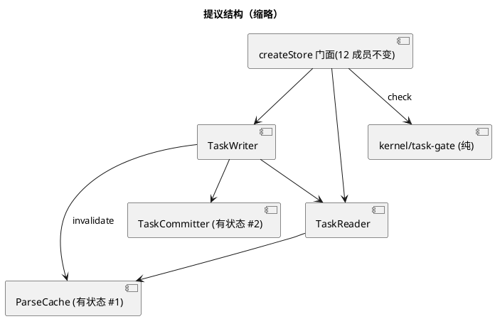
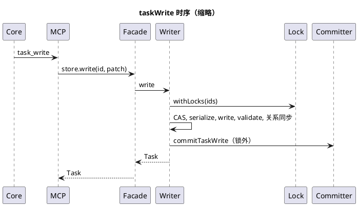

# 超大闭包工厂（store/client 工厂）职责过多：RUP 分析与设计

范围：只做分析与设计，未改任何源码。源码引用均来自主检出 `/data/home/yale/work/quay/packages/...`，行号以本次读到的为准。
图文件：`store-factories-current.puml`、`store-factories-proposed.puml`、`store-factories-seq.puml`。
**PlantUML 未渲染校验**（本机无 java/plantuml），仅逐行人工核对 `@startuml/@enduml` 与括号配对，只用基础语法。

标注约定：**[实测]** = 读了函数体或跑了命令且核对了命中内容；**[假说]** = 未被检验，每条写明「若为假会看到什么」。
行数口径：「总」= 物理行（含注释与空行），「码」= 去掉纯注释行与空行（awk 按行首 `//` `*` `/*` 判定，注释内嵌行尾的不计）。

## 摘要

- 两个大工厂**读过函数体**：`createStore` 1758 行（码 958）含 42 个嵌套函数、10 组职责；`createGoalStore` 1221 行（码 746）含 18 个嵌套函数、9 组职责（其中 `write` 单函数 578 行、3 个阶段）。
- 反直觉的关键事实 [实测]：两个工厂的「闭包」几乎不承载共享状态。`createStore` 的可变状态只有 5 个（`parsedCache`、`persistentCache`、`persistentCacheLoaded`、`persistentCacheDirty`、`_gitRoot`），直接触碰它们的只有 6 个函数；`createGoalStore` 的闭包只有 4 个**不可变**常量。它们不是「状态纠缠」，是「碰巧住在一起」。所以拆分的技术风险比体量暗示的小，主要风险在行为等价与注释承载的语义。
- 重复不是同一个缺失抽象，是**两个**：(A) 文件型 frontmatter 记录 store 的骨架（adr/meta/doc/goal 四个，底座 `frontmatter-store-base.ts` 已存在但只覆盖下层）；(B) 任务生命周期闸语义（native 的 `check` 与 github 的 `checkGate` 两份复制，且已经分叉）。
- 推荐：形态 A（协作对象/纯函数 + 薄门面），门面签名与返回成员不变；只有两处真有状态的协作者（解析缓存、git 根记忆）用工厂，不引入 class。

## 1. 现状

### 1.1 createStore（`packages/quay-native/src/store.ts:413-2170`）[实测]

返回对象 12 个成员（2156-2169）。各成员行数与依赖的闭包变量（`T`=tasksDir 不可变参数，`PC`=两级解析缓存，`G`=_gitRoot，`D`=storeDefaultStatus）：

| 成员 | 行范围（总/码） | 直接/经由依赖的闭包状态 |
|---|---|---|
| get | 773-839（67/48） | T、PC（读写 parsedCache 与 persistentCache） |
| list / listWithMalformed | 1021-1046 / 1058-1068 | T、PC（ensureLoaded + flush，间接） |
| queryPage（含 getMeta 1250-1272） | 1114-1236（123）+ 23 | T、PC |
| write | 1614-1788（175/96） | T、D、PC（invalidate）、G（commit）、锁、关系 |
| delete(deleteTask) | 1797-1826（30） | T、PC、G |
| appendNote | 1828-1866（39） | T、PC |
| check | 1934-2154（221/142） | 仅经 `get`/`readRaw`，无自有状态 |
| artifactSections | 1903-1927（25） | 无（只用常量 MIN_SECTION_CHARS） |
| childrenStatus | 933-955（23） | 仅经 `get` |
| detectShape / contractKeysPresent | 模块级（145、208），门面里只是转发 | 无 |

内部非成员函数（32 个）按职责分组，行数为总/码：

| 职责组 | 行范围 | 总/码 | 耦合对象 |
|---|---|---|---|
| 路径安全（assertSafeId/filePathFor/lockPathFor，ADV-004） | 438-468 | 31 | T |
| 文件锁（acquire/release/withLock/withLocks） | 470-556 | 87/57 | T（路径） |
| 编解码（parse/serialize；`validateWrittenYaml` 与 `FRONTMATTER_RE` 在模块级 318-411） | 566-610 | 45/25 | 无 |
| 两级解析缓存（parsedCache + 磁盘 `.quay-parse-cache.json`） | 628-764 | 137/62 | **唯一真共享可变状态**：get/getMeta/list*/queryPage/写路径全部经它 |
| 视图模型（toViewModel，含坏 status 兜底与 `malformed` 标记） | 841-905 | 65/39 | 无 |
| 查询（matchesListFilter/walkTasks/list*/queryPage/getMeta） | 968-1272 | ≈260 | PC |
| 关系完整性（findCurrentParents/add,removeChildRef） | 1285-1327 | 43/33 | 锁、PC |
| git 提交传播策略（resolveGitRoot/currentBranch/ffPush/commitTaskWrite/日志） | 1344-1566 | 223/149 | G；其中 `classifyTaskWriteChange` 及 3 个纯辅助 1410-1482（73/58）无任何闭包依赖 |
| 写事务（write/deleteTask/appendNote：锁+CAS+创建守卫+回滚+AC-190 写面+关系同步） | 1614-1866 | ≈244 | 以上全部 |
| 生命周期闸（artifactSections + check） | 1886-2154 | 263/163 | 仅 get |

**依赖矩阵摘要 [实测+人工归类]**：42 个嵌套函数里，直接引用可变状态的只有 6 个（invalidateCache、ensurePersistentCacheLoaded、flushPersistentCache、get、getMeta、resolveGitRoot）；至少 14 个不引用任何闭包变量（isJsonSafe、deepEqualSelfOnly、stripSelfOnlyFrontmatter、maskSelfOnlyBody、classifyTaskWriteChange、matchesListFilter、toViewModel、parse、serialize、currentBranch、inHead、ffPushToDevelop、logPropagationOutcome、releaseLock；artifactSections 只引用闭包常量 MIN_SECTION_CHARS）。真正「共享状态」的簇是 {解析缓存, get/getMeta, 查询, 写事务的 invalidate}；`check`/`childrenStatus`、git 传播策略、classify 只是碰巧住在一起。（该归类由我人工完成，未用工具验证；若为假，则会在拆出纯函数后出现 TS 的 "cannot find name" 编译错误——这正是迁移第 1 步的检验。）

> 注释占 45%（1758 总 vs 958 码）：这些注释承载了大量事故语义（ADV-004、M89、AC-190、COMMIT-AFTER-WRITE…）。拆分时**注释必须随函数搬走**，否则事故档案与代码脱钩。

### 1.2 createGoalStore（`packages/quay/src/goal-store.ts:1543-2763`）[实测]

闭包变量只有 `goalDir`、`cap`、`staleMs`、`storeFidelityJudge`（1547-1550），**全部不可变**；所有读盘都走模块级函数（`fileNameForId(goalDir,…)`、`ledgerEvidenceMap(goalDir)`、`gateTails(goalDir)`…）。唯一的跨调用可变状态是进程全局 `process.env[GOAL_ACCEPTANCE_ACTIVE_ENV]`（重入保护），在 1792-1805 与 2056-2104 各手写一遍「设置 → try → finally 还原」。

返回 14 个成员（2762）：

| 成员 | 行范围（总/码） | 依赖 |
|---|---|---|
| get / list | 1605-1620 / 1622-1641 | goalDir、账本、annotate* |
| activeGoals / listActiveCriteria / isGoalAchieved | 1644-1664（21/16） | list |
| checkWithinCap / checkStaleness | 1669-1740（72/57） | list、cap / staleMs |
| checkAchievedFailing / checkReverifyScope | 1761-1860（100/72） | list、**spawn 判据 shell + 改 env** / 纯读 |
| frozenAchievedAcs / checkStalePass | 1869-1960（92/64） | list、`gateTails` |
| sweepFrozen | 1977-2106（130/91） | frozen、**spawn 判据 + 追加 gate 事件 + 改 env** |
| write | 2128-2705（**578**/298） | 几乎一切：cap、judge、list、activeGoals、flipGoal、锁、git 提交 |
| writeBatch | 2712-2760（49/45） | write（commit:false）+ commitStoreBatch |

`write` 的三个阶段（行范围按注释/语句边界划分）：①校验与不变量 2189-2436（248/102：意图 CAS、必填字段、GOAL 需 ≥1 个 AC、判据归因「只缩不增」）；②激活闸 2437-2561（125/54：跑判据、保真度评审）；③装配/持久化/提交 2562-2704（143/103：statusLog、supersede 翻转、cap 检查、字段排序、写盘、陈旧信号、提交 action 推导）。

模块其余部分（非闭包，已是独立函数 [按函数边界估计]）：判据归因 lint 726-1360 ≈640 行；账本读取 191-460 ≈270；陈旧信号载体 459-600 ≈140；配置/保真度胶水/`runGoalStoreCli`（2946-3411，466 行）≈760。**goal-store.ts 的体量问题一半在闭包外**，闭包拆分只解决其中一半。

职责组 9 个：id/status 守卫、视图模型+读、派生查询、不变量检查器（cap/stale）、I5 重验（跑判据）、冻结人口+陈旧通过读数、轮转 sweep、写事务（3 阶段）、批量写。

### 1.3 其余三类工厂 [实测]

- `createAdrStore`（adr-store.ts:78-232，≈154 行）、`createMetaStore`（meta-store.ts:95-，110 行）、`createDocumentStore`（document-store.ts:66-170，103 行）：无可变状态，全是 `(dir)` 的函数，已用 `frontmatter-store-base.ts`（124 行：`parseFrontmatter/serializeFrontmatter/slugify/fileNameForId/withFileLock`）。职责单一（一种记录的 CRUD+提交），**不属于「职责过多」，属于「骨架被抄了 3-4 遍」**。
- `createGithubClient`（github-client.ts:656-1025，370 行）：闭包只有 `owner/repo/maxIssues`；业务逻辑已大量下沉为模块级纯函数（`issueToViewModel`、`computeStatusWrite`、`setChildCheckboxes`、`checkGate`…）。内部重复的是 `gh api` 参数拼装：`repos/${owner}/${repo}/issues/${number}` 出现 12 次、`/^gh-(\d+)$/` 7 次。**职责并不多，不建议拆**，只收敛这两处样板即可。

## 2. 分析类（RUP boundary / control / entity）

| 类型 | createStore | createGoalStore |
|---|---|---|
| boundary（对外面） | 12 成员门面、ConflictError/AlreadyExistsError（MCP 层按 `err.name` 识别：mcp-server.ts:280、quay-native.ts:409/453） | 14 成员、GoalIntentConflictError |
| control（流程/策略） | 写事务、git 传播策略、生命周期闸、查询分页 | 写三阶段、sweep、I5 重验、检查器 |
| entity（持久形态/状态） | 编解码、解析缓存（唯一有状态）、视图模型、路径/锁 | 视图模型、账本/陈旧载体读取 |

### 2.1 五个工厂之间的重复 [实测]

方法：node 脚本，对每个文件的工厂行范围取 trim 后长度 ≥12、非注释的行，把目录名/种类名规范化（adrDir/metaDir/docDir/goalDir→DIR，ADR/META/DOC/GOAL→K），按整行相等统计。打印的前 3 条命中（goal 对小 store）：`1547 fs.mkdirSync(goalDir…)`、`1552 function assertSafeId(id…)`、`1554 throw new Error(`。注意：这个口径对 goal 偏宽（命中多是泛型样板），所以下面只把它作「存在性」证据。

| 重复 | 证据（文件:行） | 量 |
|---|---|---|
| 记录 store 骨架（四个文件同序出现同一组 7 个标志：assertSafeId、assertSafeStatus、`fs.statSync(p).mtimeMs`、`.sort(String(a.id).localeCompare…)`、`existingFile`、`ordered`+`OWNED_KEYS.has`、`action` 推导） | adr-store.ts:81/88/160/176/191/209-214/222；meta-store.ts:98/105/136/151/164/178-183/190；document-store.ts:69/76/105/120/133/147-152/159；goal-store.ts:1552/1561/1613/1640/2190/2623-2631/2678 | adr 58/99、meta 51/66、doc 53/77 行（59%/77%/69%）与某个兄弟 store 逐行相同；三者共有的不同行 38 条 |
| commit 包装 `commitAdrFile/MetaFile/DocFile/GoalFile`（仅 kind 与回退路径不同） | adr-store.ts:239-249、meta-store.ts:80-91、document-store.ts:176-186、goal-store.ts:1519-1529 | 4×≈11 = ≈44 行 |
| 任务 store 与底座（**未使用底座**） | `serialize` store.ts:607-610 ≡ frontmatter-store-base.ts:38-40；`FRONTMATTER_RE` store.ts:318 ≡ base.ts:5；锁 store.ts:470-556 ≈ base `withFileLock`（wx 创建 + 5000ms 陈旧回收 + 3000ms 超时同一算法）；`resolveGitRoot` store.ts:1345-1357 ≈ store-commit.ts:140-150（同一条 git 命令） | 见 §3.4 的三处差异 |
| 生命周期闸（native vs github） | store.ts:1886-2154（≈270 行）≈ github-client.ts:415-655（≈240 行：extractGateSection/gateArtifactSections/childrenStatus/checkGate） | 逻辑复制，已**分叉**，见下 |
| 并发/冲突检测 | store.ts 的 ConflictError（CAS，status 比较）、goal-store.ts 的 GoalIntentConflictError（intent 比较）、github 无（`expectedStatus` 在 quay-github/src 中 0 次出现） | 三种语义，不是同一抽象 |
| 列表过滤 | store.ts:968-986（matchesListFilter）；adr/meta/doc/goal 的 `.filter((x) => (filter.k ? … : true))` 链 | 形态不同（任务要支持标签数组/前缀/搜索与分页），不建议硬统一 |

**native vs github 闸的分叉 [实测，读码]**：①github `gateArtifactSections`（github-client.ts:437-445）硬编码 Proposal/Plan/AC/DoD 四个标题并用 `\b`，没有 shape 分发；native 走 `SHAPE_REGISTRY`，且 store.ts:1908-1916 的注释明确记载 `\b` 对 CJK 标题是死代码、已修。②github 在 todo→ready 要求 **AC 全部勾选**（github-client.ts:551-563），native 在 store.ts:2001-2020 明确「反转 QN-019，不要求勾选」。②被 `quay-github/test/gate.test.mjs:39` 固定为期望行为——所以这是**被测试锁定的有意或无人察觉的分叉**，统一它会改变 github provider 行为。

**是同一个缺失抽象吗？ 否，是两个（外加一个不该合并的）**：
- (A) 「frontmatter 记录 store」骨架：adr/meta/doc 近乎同构，goal 的 get/list/write 外壳同构（内核不同）；`frontmatter-store-base.ts` 是下层已有抽象，缺的是它**之上**那一层（id/status 守卫 + get/list/write 骨架 + commit 包装）。任务 store 是第五个使用者，但因缓存、CAS、多文件关系、分支感知传播，只能共享**下层原语**，不能共享骨架。
- (B) 任务生命周期闸：与存储无关的纯语义（输入=任务视图模型+取子任务回调），native 与 github 各抄一份。
- 不该合并：github 的 `gh api` 命令层、native 的 git 传播策略，各自是 provider 专有。

## 3. 设计元素

### 3.1 拆分方案（形态 A）

任务 store（`quay-native/src/store.ts` 保留为门面，其余放新目录 `store/`；新文件名为建议）：

| 协作者 | 内容 | 状态 | 接口要点 |
|---|---|---|---|
| `task-paths.ts` | assertSafeId/filePathFor/lockPathFor | 纯 | `(tasksDir,id)→string` |
| `task-lock.ts` | acquire/release/withLock/withLocks | 无状态 | `withLocks(tasksDir, ids, fn)` |
| `task-codec.ts` | parse/serialize/validateWrittenYaml/FRONTMATTER_RE | 纯 | 现有函数原样搬 |
| `parse-cache.ts` | 两级缓存 | **有状态 #1** | `createParseCache(tasksDir): ParseCache`（get/set/invalidate/ensureLoaded/flush） |
| `task-view.ts` | toViewModel/matchesListFilter/stripHeadingsForSearch | 纯 | 现有函数原样搬 |
| `task-reader.ts` | get/getMeta/listIds/readRaw | 依赖 cache | `createTaskReader(tasksDir, cache)` |
| `task-query.ts` | list/listWithMalformed/queryPage | 依赖 reader+cache | 同现有签名 |
| `task-relations.ts` | findCurrentParents/add,removeChildRef | 依赖 reader+codec+cache | 调用方须已持锁（保留现有契约） |
| `task-change-class.ts` | classifyTaskWriteChange 及 3 个辅助 | 纯 | 73 行，可单测 |
| `task-committer.ts` | git 传播策略 | **有状态 #2**（记忆 gitRoot） | `createTaskCommitter(tasksDir).commitTaskWrite(id,verb,kind)` |
| `task-writer.ts` | write/deleteTask/appendNote | 编排者 | 依赖以上全部 |
| `kernel/task-gate.ts`（Core，新） | artifactSections/childrenStatus/check 的纯化 | 纯 | `checkTaskGate(task,{getChild,readRawStatus})` |

门面 `createStore(tasksDir, opts)` 只做装配（≈40 行），返回的 12 个成员名与签名不变。

Goal store：因为闭包无可变状态，拆分是「把嵌套函数提到模块级并显式传 `env={goalDir,cap,staleMs,judge}`」。`goal-read`、`goal-checks`（纯读）、`criterion-runner`（`withReentrancyGuard(run)`，消灭 1792-1805 与 2056-2104 两份手写 env 还原）、`goal-sweep`、`goal-write`（`validateGoalWrite → activationGates → persist` 三阶段）；模块级的 lint/账本/载体/CLI 只搬文件（形态 C）。

记录 store：新增 `frontmatter-record-store.ts`，`createRecordStore(spec)`（spec = idRe、statuses、ownedKeys、默认 status、toViewModel、kind、slug 回退）；adr/meta/doc 变成几十行的 spec；**goal 是否迁入见开放问题 2**。

github：不拆；`checkGate` 系列改为引用 `kernel/task-gate.ts`（需先裁定开放问题 1）；收敛 `repos/${owner}/${repo}/issues/${number}` 的 12 处拼装为一个局部 helper。

### 3.2 三种形态对比（TS 语境）

| | A 协作对象+薄门面（函数/工厂） | B `class Store` 持有协作者 | C 保持函数，只拆文件 |
|---|---|---|---|
| 解决「职责多」 | 是：职责成独立单元，可单测 | 是，但多一层 `this` | 否：函数仍在同一闭包，只是文件变短 |
| 对外签名不变 | 是（门面） | 需 `new` 或工厂包装；`const {get}=store` 式解构会丢 `this` | 是 |
| 与本仓库风格 | 一致（5 个工厂都是闭包工厂） | 偏离；ADR/测试/dist 打包均按工厂写 | 一致 |
| 风险 | 中（拆闭包） | 中高（`this` 绑定、测试里 `createStore(...).x` 调用链虽无解构，但无法证明所有消费者不解构，见 §4） | 低，但收益也低 |
| 适用 | 任务 store、goal 的写阶段 | 无充分理由 | goal 模块级的 ≈1800 行（lint/账本/CLI） |

取舍：**A 为主，C 用于模块级部分，不用 B**。理由：①闭包内没有需要 `this` 承载的共享可变状态（goal 为 0，任务 store 仅 2 簇），class 不会让函数变小，只增加绑定面；②有状态的两处（缓存、git 根）用小工厂返回接口，行为等价于 class 且不改风格；③「不为用类而用类」——唯一值得写成 class 的是 `ParseCache`（4 个相互约束的字段 + 加载/脏/刷写生命周期），但工厂同样能封装，只有当出现多实例/继承需求才改。

### 3.3 对外契约如何保持不变 [实测 + 假说]

- 契约链：Core `ProviderClient`（provider-client.ts:56，17 个方法：15 个数据方法 + `manifest` + `close`）→ MCP 协议 → provider 的 15 个 `registerTool`（native mcp-server.ts:150-591，名字 task_/adr_/goal_/meta_ 各 list/get/write 等）。**拆分只发生在 `store.write(id, patch)` 之下**，MCP 工具 schema、`structuredContent` 形状、`isError` 映射一个字符都不动。
- 必须保持的隐式契约 [实测]：①`ConflictError.name === "ConflictError"`、`AlreadyExistsError.name`——MCP/CLI 按 `err.name` 字符串识别（mcp-server.ts:280、quay-native.ts:409/453），搬文件后类仍须从 `store.ts` 导出且 `name` 不变；②门面仍从 `store.ts` 导出 `createStore/ConflictError/AlreadyExistsError/VALID_STATUSES/SHAPE_REGISTRY/detectShape/sectionAfterHeading/contractKeysPresent/resolveDefaultStatus`（测试与 CLI 直接 import）；③`console.error` 的措辞（部分测试/运维会 grep）。
- 没有 TS 类型层面的跨进程一致性（已知事实）。拆分**不改善也不恶化**这一点；现有 `provider-abi-conformance.test.mjs` 与 `abi-symmetry.mjs` 是唯一的契约护栏，且 github 腿需要真 `gh`（live）。**假说**：拆分后可顺带让 `ProviderClient` 的返回类型被 provider 端引用以获得编译期一致性；若为假（跨进程字段仍靠 JSON），则该收益不存在。这属于另一个任务，本设计不依赖它。

### 3.4 任务 store 与底座不统一的三处差异 [实测]

store.ts 的锁与 `frontmatter-store-base.ts` 的 `withFileLock`：①锁文件名 `<id>.md.lock` vs `<id>.lock`；②store 在重试间自旋 20ms，base 无间隔（紧循环）；③store 有按全序获取的 `withLocks`（多文件父子写），base 只有单锁。①意味着两套锁**互不排斥**——不过两者保护的是不同目录的不同文件，本身无冲突。统一锁会改变磁盘上的锁文件名（升级窗口内新旧进程互不可见），**第一轮不统一**，只把它列为开放问题 3。

## 4. 迁移方案

原则：每步**行为等价**、可单独提交、可单独回滚；先搬纯函数（编译器可证），后拆有状态的。

| 步 | 内容 | 等价性验证 | 风险 |
|---|---|---|---|
| 0 | 建基线：记录当前 `scripts/test.sh` 的相关文件绿/红清单；对 `task_list/task_get/task_write` 在固定 fixture 上存 golden JSON | 之后每步对比 golden | 低 |
| 1 | 纯函数外提：classify 簇（1410-1482）、toViewModel、matchesListFilter、isJsonSafe、parse/serialize 搬到模块级/新文件，闭包内改为引用 | 编译 + `store.test.mjs`、`parse-cache.test.mjs`、`cas-write.test.mjs`、`yaml-frontmatter-colon.test.mjs` | 低 |
| 2 | 提取 `createParseCache`（唯一共享可变状态） | `parse-cache.test.mjs`（含跨进程持久层、同 mtime 同 size 重写失效）、`quay/test/gap-abi-task-list-pagination-payload-bound.test.mjs`、`quay/test/unparseable-frontmatter.test.mjs` | **中**：读后写陈旧缓存类缺陷（见 :630-646 的 gap） |
| 3 | 提取 lock/paths/relations/committer | `lock.test.mjs`、`concurrent-writer.mjs`/`reparent-writer.mjs`（多进程）、`relation-sync.test.mjs`、`goal-ac-write-face.test.mjs`、`default-status.test.mjs`；committer 另跑 `quay/test/store-commit.test.mjs` | **高**：写路径、锁序、git 传播；只读单测不覆盖多进程竞态 |
| 4 | 提取 reader/query/writer，`store.ts` 收为门面；`check` 抽到 `kernel/task-gate.ts` 纯函数（先不动 github） | `gate-correctness`、`gate-shape-dispatch`、`gate-checked-state`、`gate-gameability`、`compound-gate(-recursive)`、`live-a-longform-headings`、`adversarial-eval`、`create-validation`、`edit-validation`（均在 quay-native/test）；Core 侧 `mcp-server.test.mjs`、`provider-abi-conformance.test.mjs`、`serve*.test.mjs` | 中 |
| 5 | goal-store：先 C（lint/账本/载体/CLI 搬文件，零逻辑变更），再提 `withReentrancyGuard`，再拆 write 三阶段 | `quay/test/goal-store.test.mjs`、`goal-gate.test.mjs`、`goal-born-draft-zero-ac-gate.test.mjs`、`goal-criterion-timeout-resolution.test.mjs`、`gap-goal-record-completeness-undefined.test.mjs`、`ac2xx-criterion-address-derivation` 系列、`gate/factories/goal.ts` 的调用者 | 中高：`write` 三阶段间共享大量局部变量（`frontmatter/prevStatus/nextStatus/activating`），拆分需显式传 context 对象 |
| 6 | 记录 store 骨架：先让 adr/meta/doc 迁 `createRecordStore`，goal 暂缓 | `adr-store.test.mjs`、`document-store.test.mjs`、`frontmatter-store-base.test.mjs`、`gap-frontmatter-slugify-drops-non-ascii.test.mjs`、`adr-abi.test.mjs`、`document-cli.test.mjs` | 低中 |
| 7 | github 闸改引用 `kernel/task-gate.ts` | **仅在开放问题 1 裁定后做**；`quay-github/test/gate.test.mjs`、`gate-gameability.test.mjs`、`compound-gate.test.mjs`、`task-check-passthrough.test.mjs` | 会改变 github 行为 |

跨步骤的通用风险与护栏 [实测]：
- **构建产物**：`packages/quay-native/dist/quay-native.js`（gitignored）与 `plugin/vendor/quay-native/dist/quay-native.js` 是 esbuild 打包产物，`createStore` 在其中被内联（dist:7713）；每步都要重建并至少跑一次打包后的 CLI 冒烟，否则「源码绿、产物旧」。CLAUDE.md 另有「`dist-verify-node-floor` 与 test.sh 覆盖不到」的提醒。
- **生产写路径**：`createStore` 被 `plugin/scripts/loop-complete-task.ts:110`、`malformed-task-check.ts:88`、native CLI/MCP 使用；写路径的缺陷会直接污染 `tasks/*.md`。步骤 3、4 应在私有 worktree 的**临时 tasks 目录**上做对拍（旧实现 vs 新实现对同一输入序列，比较落盘字节与 git 提交），不在主检出上试。
- **回滚**：每步一个提交，回滚=revert 该提交；因门面签名不变，上下游无需联动。步骤 7 单独成提交，因为它改变 provider 行为。
- 消费者 import 路径不变：`../src/store.ts` 仍是入口，测试 20+ 个文件无需改 import（grep `createStore(` 命中 packages/*/test 与 plugin 下 34 个测试路径，`createGoalStore` 的测试 20 个）。
- 未发现解构取方法的调用（grep 命中唯一一处是 `const { tasks, malformed } = createStore(tasksDir).listWithMalformed()`，解构的是返回值，不是方法脱离）[实测，仅 packages/plugin 下 .mjs/.ts；其它目录（experiments/、scripts/）未查]。

## 5. 开放问题与未读部分

需要人拍板：
1. **github 闸是否与 native 统一？** native 已反转 QN-019（todo→ready 不要求 AC 勾选），github 仍要求且被 `gate.test.mjs:39` 固定。统一 = 改 github 行为（并改该测试）；不统一 = 抽出的 `task-gate` 要带一个 `requireAcCheckedAtReady` 开关保留分叉。**假说**：github 的分叉是遗漏而非有意——若为假，会在 quay-github/DESIGN.md 或相关 ADR 里找到「github 保持严格语义」的理由；我只 grep 了 DESIGN.md/src/test 里的 `QN-019|checked-state`（无命中），没有读 ADR。
2. **goal-store 是否迁入 `createRecordStore`？** 它的 get/list/write 外壳同构，但内核（判据校验、激活闸、statusLog、supersede）远超骨架。建议：先只迁 adr/meta/doc，goal 只复用其 helper。
3. **是否统一锁？**（见 §3.4）统一 = 改磁盘锁文件名与重试策略，涉及升级窗口；建议不统一，仅文档化。
4. **门面要不要缩减？** 12 个成员里 `artifactSections/childrenStatus/detectShape/contractKeysPresent` 看上去是内部实现被导出；我没有查它们的全部外部调用者，若无人用，门面可缩到 8 个。缩减是另一个任务，本设计保持 12 个。
5. **步骤 3/4 是否要求先补「多进程写对拍」测试？** 现有 `concurrent-writer.mjs`/`reparent-writer.mjs` 是辅助脚本，我没有读它们被哪个测试驱动、覆盖多少。

没来得及读/未验证的部分：
- `goal-store.ts` 726-1360（判据归因 lint）、191-460（账本读取）、459-600（陈旧载体）、2810-3411（CLI）只读了函数列表与签名，**没读函数体**，上文对它们的行数是按函数边界的估计，职责归类依据是函数名与注释首行（**假说**：若为假，则拆分步骤 5 的「零逻辑搬文件」前提不成立，例如某个模块级函数其实读了闭包外的可变模块变量；`grep -n "^let " goal-store.ts` 可一条命令检验）。
- `store.ts` 60-260（SHAPE_REGISTRY、detectShape、sectionAfterHeading 等模块级函数）只看了签名；`validateWrittenYaml` 读了。
- `quay-github/src/mcp-server.ts`、`quay-native/src/mcp-server.ts` 的 goal/adr/meta 工具体、`gate/factories/goal.ts`、`goal-cli`（runGoalStoreCli）没读；`task-parsing.ts` 的 `parseFrontmatterCompletely` 只读了头注释。
- 所有测试文件只读了文件名与 2-3 个头注释，**没有跑任何测试**，所以「受影响测试清单」是依据 import/grep 的推断，不是失败实测。
- 没有量化运行期性能（解析缓存拆分会多一层间接调用）；**假说**：开销可忽略——若为假，`gap-abi-task-list-pagination-payload-bound` 与列表路由的耗时断言会变红。
- github 腿的契约测试需真实 `gh api`，本环境未验证其是否可跑。

## 内嵌图（缩略；完整版见 puml 文件）

